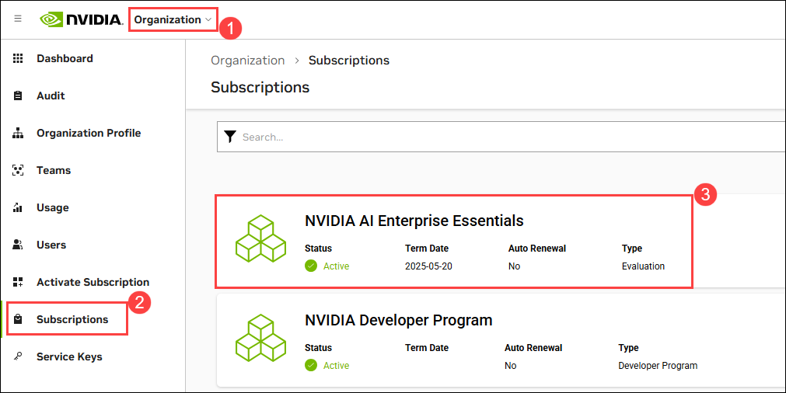

# Challenge 0

### Estimated Time: 60 minutes

## Introduction

At this point you have a chatbot that can query the hotel brochures. In this Challenge, you will integrate the chatbot into the updated Contoso Hotel application.

## Challenge Objectives:

## Prerequisites

- **NVIDIA AI Enterprise License**: Riva ASR NIM is available for self-hosting under the NVIDIA AI Enterprise (NVAIE) License.
- **NVIDIA GPU(s)**: Riva ASR NIM runs on any NVIDIA GPU with sufficient GPU memory (e.g. Standard NC4as_T4_v3).

## Challenge Objectives:

1. **Generate NGC API KEY**

   - Login or Create a Nvidia account 

   - Navigate to https://build.nvidia.com/ and log in using your email id. If not create an account.

   - Verify you are provided with 1000 free credits, each translating into one API call by clicking on **Profile**. 
   
   -  Navigate to [Nvidia](https://ngc.nvidia.com/signin) account using your credentials to proceed and Click on the **join**.
    
   - Once your account is created or you've successfully logged in.

   - You will see a pop-up. On the **Set Email Preferences For Your Services** page, you can either close it or click **Set Email Preferences** to receive updates regarding security, announcements, and maintenance for all your services.

      

   - In the search bar, look for **parakeet-ctc-1.1b-asr**.

      

   - Scroll down and select **parakeet-ctc-1.1b-asr**. 

      

   - On the left-hand side, click **Get Container**.

      

   - A pop-up will appear on the **Approval Required** page. Click **Join** for the **NVIDIA Developer Program**, and it will redirect you to the NVIDIA Developer Portal.

      

   - On the **NVIDIA Developer Portal**, under **Integrate NIM into your application**, provide the necessary details and click **Join**.

      

   - Navigate back to your **NVIDIA Account**. From **Organization**, click **Subscriptions** on the left. Here, you will see the **Active** status for the NVIDIA Developer Program.

      

   - Click on **Account** at the top of the page and navigate to the **Setup** section.

      

   - Click on **Generate API Key** to create a new key for accessing the necessary services.

      

   - From the top, click on **+ Generate API Key** to create a new API key.

      

   - Click on **Confirm** to generate your new API key.

      

   - Carefully copy your generated API key, essential for accessing various services and features paste the API key in the notebook. Ensure you store it securely, as it may not be displayed again after you leave the page.

      

2. Create and Connect to a GPU-Enabled Virtual Machine in Azure

   - **Create a GPU Virtual Machine** : Select **NVIDIA GPU-Optimized VMI with vGPU driver - v22.08.0 - x64 Gen 2** as the image and Choose **NC4as_T4_v3** as the VM size

   - **Configure Storage**: Set **OS disk size** to **128 GiB** and Select **Standard SSD (locally-redundant storage)** as the OS disk type and create

   - **Connect to the VM**: Connected to the GPU Virtual Machine using SSH

3. Set Up and Run NVIDIA Riva ASR Container

   - Set up the NVIDIA Container Toolkit by adding your user to the docker group:
      
      ```bash
      sudo gpasswd -a $USER docker
      
      # Apply changes (logout/login required)
      newgrp docker
      ```

   - Configure your NGC API Key:

      ```bash
      # Set your NGC API Key (replace with your actual key)
      export NGC_API_KEY="your-ngc-api-key"

      # Add to shell configuration for persistence
      echo "export NGC_API_KEY=your-ngc-api-key" >> ~/.bashrc

      # Log in to NGC container registry
      echo "$NGC_API_KEY" | docker login nvcr.io --username '$oauthtoken' --password-stdin
      ```

   - Run the NVIDIA Riva ASR Container:
      
      ```bash
      # Set model selector
      export NIM_TAGS_SELECTOR="name=parakeet-1-1b-ctc-riva-en-us,mode=all"

      # Run the container
      docker run -it --rm --name=riva-asr \
         --gpus '"device=0"' \
         --shm-size=8GB \
         -e NGC_API_KEY \
         -e NIM_HTTP_API_PORT=9000 \
         -e NIM_GRPC_API_PORT=50051 \
         -p 9000:9000 \
         -p 50051:50051 \
         -e NIM_TAGS_SELECTOR \
         nvcr.io/nim/nvidia/riva-asr:1.3.0
      ```

      > **Note**: It may take up to 30 minutes for the Docker container to be ready and start accepting requests, depending on your network speed.

   - Once the NVIDIA Riva ASR deployment is succeeded, Open a new terminal Connect to the VM and run the following command to check if the service is ready to handle inference requests.

     ```
     curl -X 'GET' 'http://localhost:9000/v1/health/ready'
     ```

   - If the service is ready, you get a response similar to the following.

     ```
     {"status":"ready"}

4: Configure Network Security Group Rules for External Access

   - In the **Network Security Groups (NSG)**, configure **Inbound Security Rules** to allow traffic for the hackathon setup:  

      - Open port `9000` with the `TCP` protocol and set the priority to `100`.  
      - Open port `50551` with the `TCP` protocol and set the priority to `101`.  

   - Open a new tab in the browser and navigate to the following URL to verify if the service is ready to handle inference requests.

      ```
      http://<nvidia-gpu-public-ip>:9000/v1/health/ready
      ```

## Success Criteria:

- Successfully generated an NGC API key from NVIDIA and verified account access.
- Verify the successful deployment of the Virtual Machine with SKU size of **Standard NC4as T4 v3** and disk size of **Standard SSD LRS 128 GiB**.
- Successfully deployed the NVIDIA Riva ASR.
- Configured Network Security Group rules to open ports 9000 and 50551
- Verified the Riva ASR service is running and accessible by checking the health endpoint
  both locally and remotely via browser (http://<nvidia-gpu-public-ip>:9000/v1/health/ready).
     
## Additional Resources:

- [Getting Started — NVIDIA NIM Riva ASR](https://docs.nvidia.com/nim/riva/asr/latest/getting-started.html)
- [az network nsg rule](https://learn.microsoft.com/en-us/cli/azure/network/nsg/rule?view=azure-cli-latest#az-network-nsg-rule-create)
- [Python Client Repository](https://github.com/nvidia-riva/python-clients.git)
- [C++ Client Repository](https://github.com/nvidia-riva/cpp-clients.git)
