# Application Modernization - Solution Guide

Last Updated Feb 12, 2025

# Challenge 01: Deploy Azure OpenAI Service and LLM Models
### Estimated Time: 30 Minutes
## Introduction

Welcome to the Deploy Azure OpenAI Service challenge! This challenge is designed to test your skills in deploying the Azure OpenAI Service and its Large Language Models (LLM). The goal is to set up the OpenAI Service and deploy LLM models.

**Azure OpenAI Service** provides REST API access to OpenAI's powerful language models, including the GPT-4, GPT-4 Turbo with Vision, ` GPT-4o`, and Embeddings model series. In addition, the new `GPT-4` and ` GPT-4o` model series have now reached general availability.

A **Large Language Model (LLM)** is a deep learning algorithm that can perform a variety of natural language processing (NLP) tasks. Large language models use transformer models and are trained using massive datasets—hence, large. This enables them to recognize, translate, predict, or generate text or other content.

**Contoso Ltd.**, a leading technological firm, seeks to enhance its product support operations. They receive many queries daily, resulting in longer waiting times and decreased customer satisfaction. To address this, Contoso is planning to implement an AI-powered solution that can handle customer inquiries effectively and efficiently.

They have chosen to deploy Azure OpenAI Service along with its Large Language Models (LLM), like ` gpt-4o` and `text-embedding-ada-002 `. These models are known for their capability of processing and generating human-like text, making them ideal for this application.

As a part of this challenge, your task is to create an Azure OpenAI service and deploy Large Language Models (LLM). The Large Language Models include **GPT-4o** and **text-embedding-ada-002.**

## Description

Your task is to deploy the Azure OpenAI Service and Large Language Models (LLMs).

### Accessing the Azure Portal

>**Important**: You can find the username and password within the Environment by navigating to the **Environment** **(1)** tab in the left pane. Then copy the **Azure Username** **(2)** and **Azure Password** **(3)**, which will be required to sign into the Azure portal in later steps. Also, you can record the **Deployment ID** **(4)** to provide a unique name to the resources during deployment.

>**Note**: Numbers and ID values may vary, kindly ignore values in screenshots and copy values from **Environment** tab.

 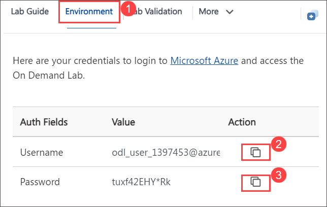
 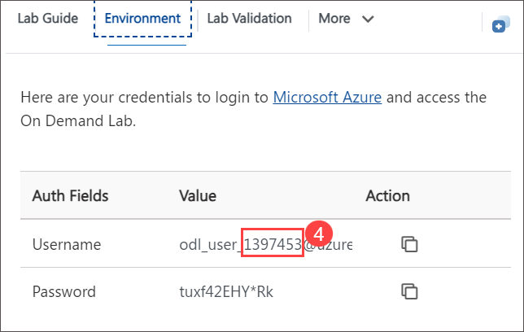

1. To access the Azure portal, within labvm, open **Microsoft Edge** and browse [Azure Portal](https://portal.azure.com/).

1. On the **Sign in to continue to Microsoft Azure tab**, you will see a login screen. Enter the following email/username **(1)** and click on **Next (2)**.
   
   - **Email/Username:** <inject key="AzureAdUserEmail"></inject>

     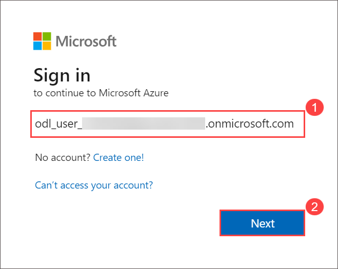

1. Now, enter the following password **(1)** and click **Sign in (2)**.

   - **Password:** <inject key="AzureAdUserPassword"></inject>

      

1. When the **Action Required** window pops up, click on **Ask Later**.

    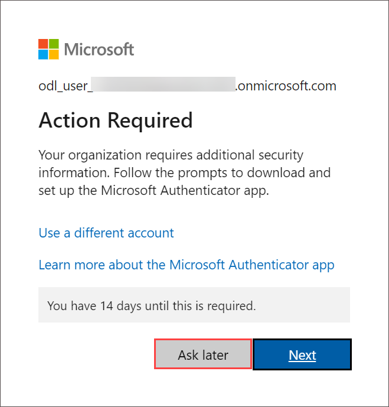
   
1. If you see the pop-up **Stay Signed in?**, click **No**.

    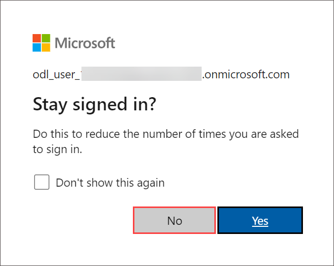

1. If a **Welcome to Microsoft Azure** pop-up window appears, click **Cancel** to skip the tour.

    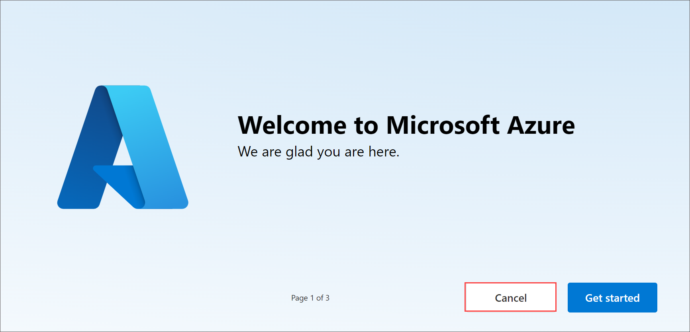

## Prerequisites

- [Azure Subscription](https://azure.microsoft.com/en-us/free/)
- [Azure OpenAI](https://aka.ms/oai/access) access is available with the following models:

  - GPT-4o
  - text-embedding-ada-002 

## Solution Guide

### Task 1: Deploy an Azure OpenAI Service

In this task, you will learn how to set up and deploy the Azure OpenAI service within the Azure Portal.

1. On the Azure Portal page, in the Search resources, services, and docs (G+/) box at the top of the portal, enter **Azure OpenAI (1)**, and then select **Azure OpenAI (2)** under **Services**.

    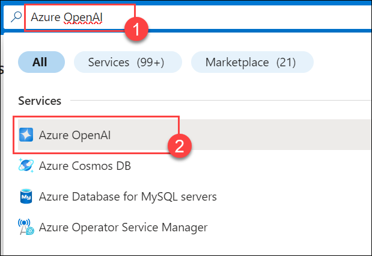

1. On the **Azure AI Services | Azure OpenAI (1)** blade, click on **+ Create (2)**.

   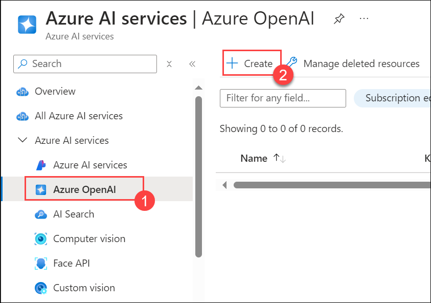

1. Specify the following details to deploy the Azure OpenAI service and click **Next (6)** thrice.

   | **Option**         | **Value**                                              |
   | ------------------ | -----------------------------------------------------  |
   | Subscription       | **Leave default subscription (1)**                                          |
   | Resource Group     | Select **Appmod (2)**                 |
   | Region             | Use the same location as the resource group **(3)**            |
   | Name               | Use the format **OpenAI-xxxxxx (4)** (replace **xxxxxx** with the **Deployment ID**) |
   | Pricing tier       | **Standard S0 (5)**                                        | 

   >**Note**: Here, xxxxxx refers to the **deployment ID** which you recorded in the last task.

    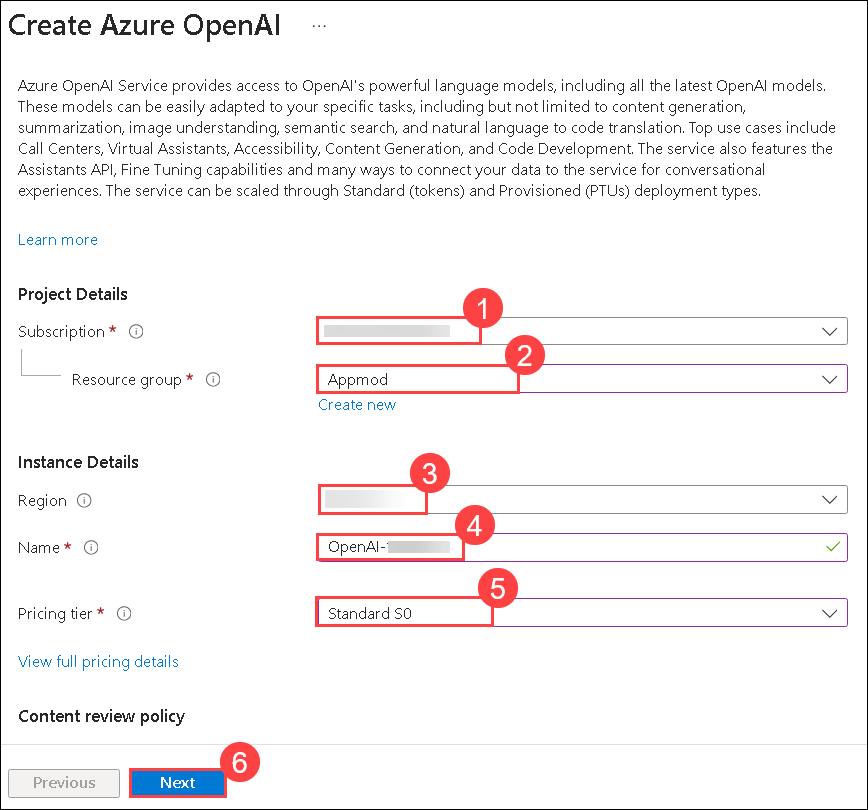

1. Once validation is successful on the **Review + submit** tab, click **Create** and wait for the deployment to complete.

     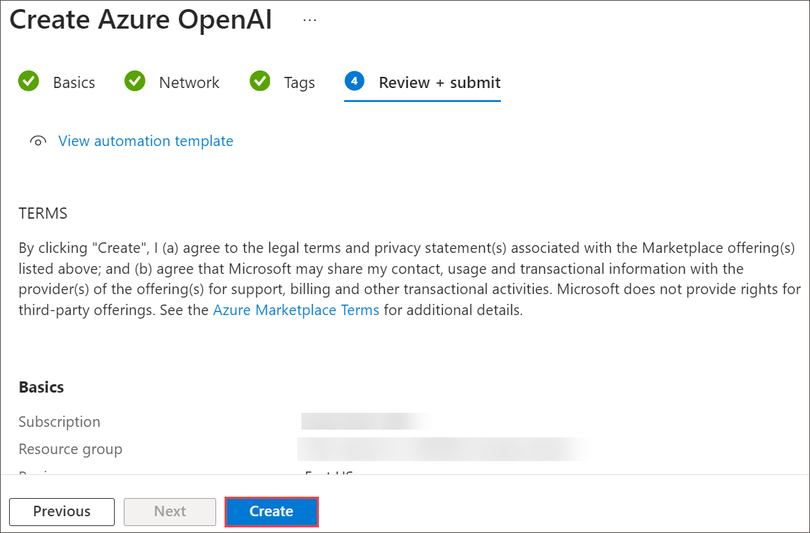  

### Task 2: Deploy a Model

Azure OpenAI provides a web-based portal named Azure OpenAI Studio that you can use to deploy, manage, and explore models. You will start your exploration of Azure OpenAI by using Azure OpenAI Studio to deploy a model.

1. On the Azure Portal page, in the Search resources, services, and docs (G+/) box at the top of the portal, enter **Azure OpenAI (1)**, and then select **Azure OpenAI (2)** under **Services**.

   

1. On the **Azure AI Services | Azure OpenAI (1)** blade, select **OpenAI-xxxxxx (2)**.

    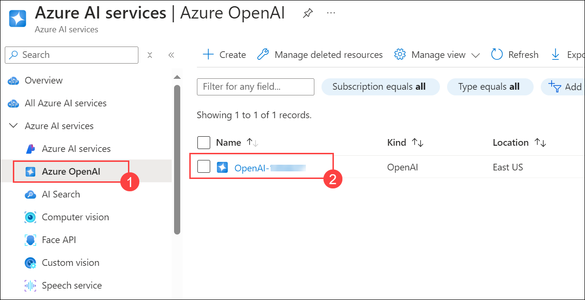

1. In the Azure OpenAI resource pane, select **Overview (1)** from the left-hand menu, then click on **Go to Azure AI Foundry portal (2)**. This will navigate you to Azure AI Studio.

   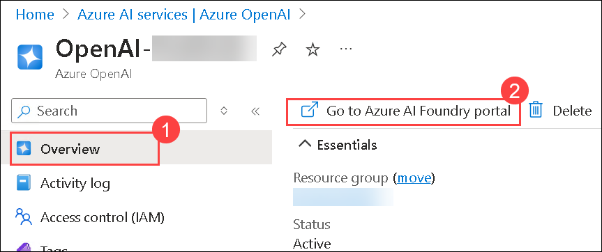

   >**Note:** If the pop up "Discover an even better Azure AI Studio experience" appears, click close to dismiss it.

1. Click on **Deployments (1)** under **Shared Resources**, then select the **+ Deploy Model (2)** drop-down. Next, choose **Deploy Base Model (3)**.

    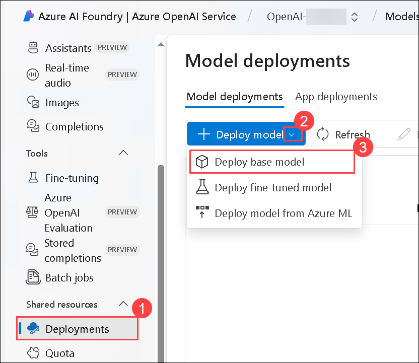

1. Search for **GPT-4o (1),** then select **GPT-4o (2)** and click on **Confirm (3)**.

    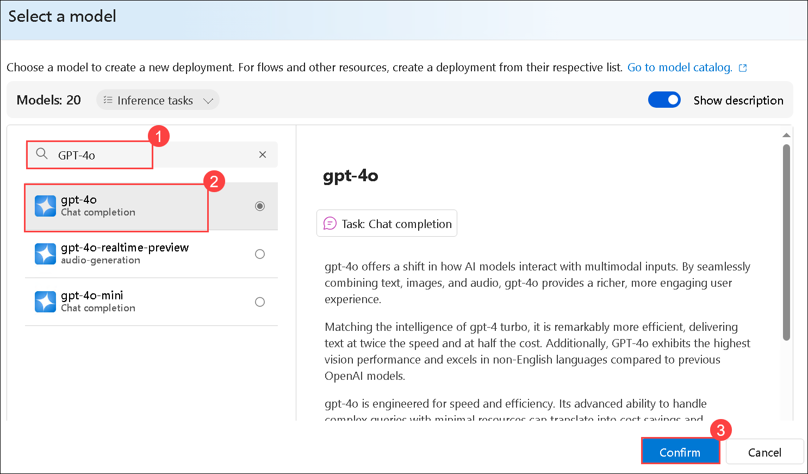

1. Within the **"Deploy model"** pop-up interface, click on **Customize**.

    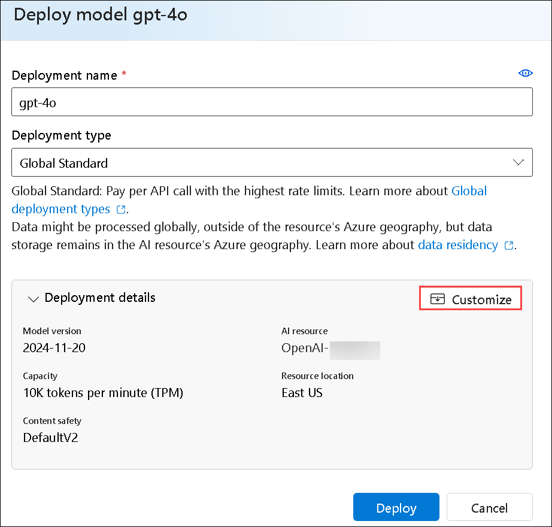

1. On the **Deploy model GPT-4o,** enter the following details:

    - Deployment name: **text-turbo (1)**
    - Deployment type: **Standard (2)**
    - Model version: **select the default (3)**
    - Tokens per Minute Rate Limit (thousands): **20K (4)**
    - Enable dynamic quota: **Enabled (5)**
    - Click on **Deploy (6)**
        
      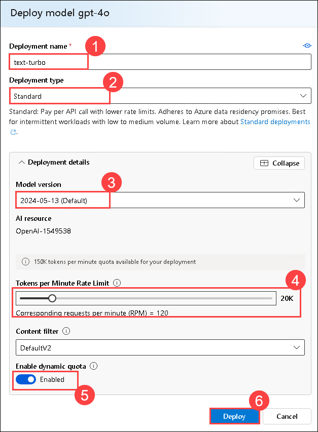

      >**Note:** If the **Customize** option doesn't appear, you can directly enter the model deployment details. 

1. Back on the **Deployments (1)** page, select **+ Deploy Model**. Next, choose **Deploy Base Model (2)**.

     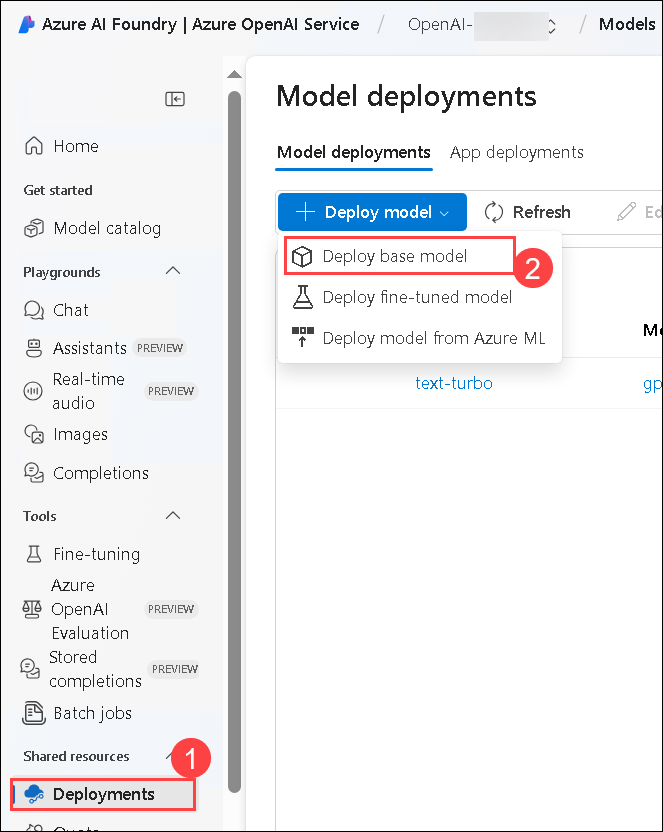

1. Search for **text-embedding-ada-002**, then select **text-embedding-ada-002 (1)** and click **Confirm (2)**.

     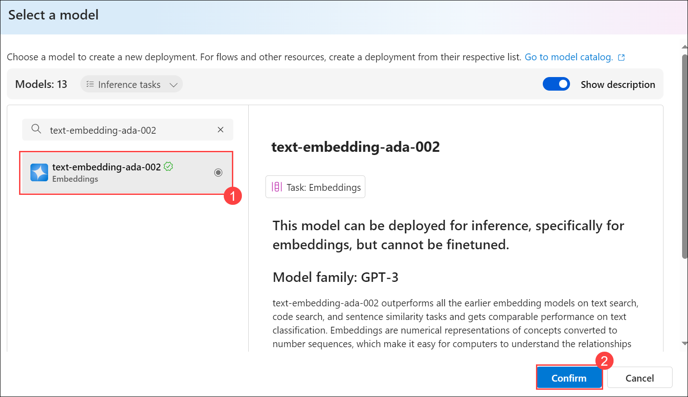

1. Within the **"Deploy model"** pop up interface, click on **Customize**.

     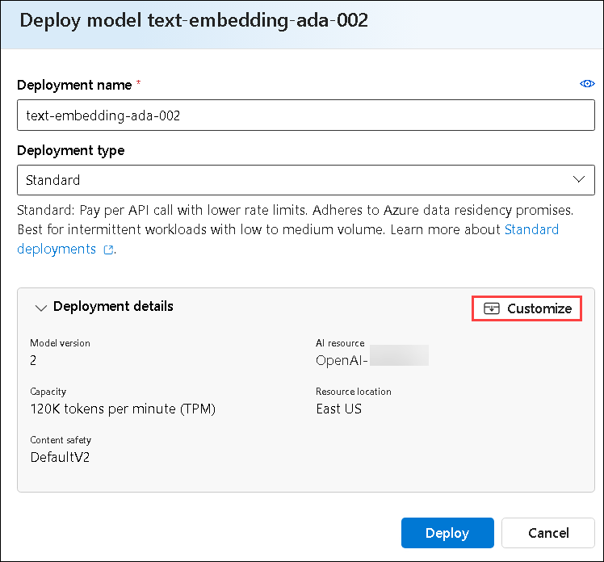

1. On the **Deploy model text-embedding-ada-002** page, enter the following details:

    - Deployment name: **text-ada-002 (1)**
    - Deployment type: **Standard (2)**
    - Model version: **Use the default version (3)**
    - Tokens per Minute Rate Limit (thousands): **20K (4)**
    - Enable dynamic quota: **Enabled (5)**
    - Click on **Deploy (6)**
        
      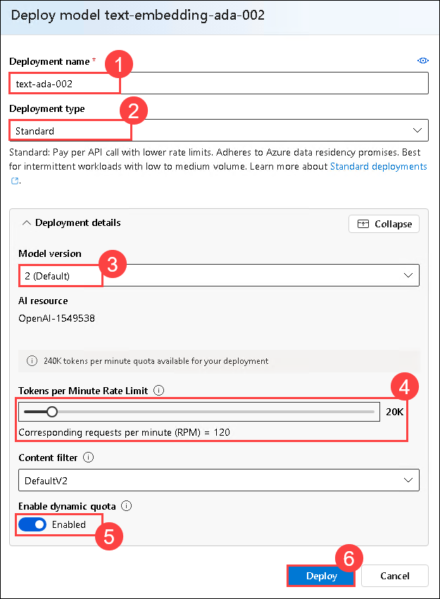

      >**Note:** If the **Customize** option doesn't appear, you can directly enter the model deployment details. 

1. Back on the **Model Deployments** page, you should be able to see the pre-created deployment models **text-turbo** and **text-ada-002**.

     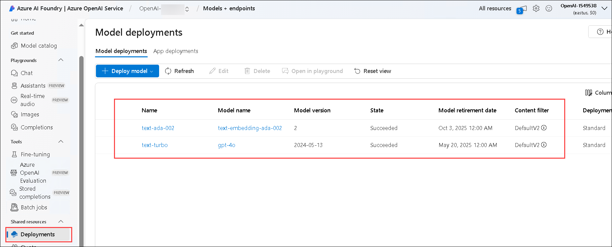

## Success Criteria:

- Successful deployment of the Azure OpenAI Service.

- Deploying Large Language Models (LLMs) with the OpenAI Service.

## Additional Resources:

- Refer to the [Azure OpenAI Service documentation](https://learn.microsoft.com/en-us/azure/ai-services/openai/) for guidance on deploying the service.

## Proceed with the next challenge by clicking on **Next**>>.
