# Challenge 03: Split and repackage the Contoso Hotel app components and deploy the updated app
### Estimated Time: 60 minutes
## Introduction

To improve the scalability of the app, Contoso plans to split the front-end components (HTML, CSS, and JavaScript files) from back-end components (APIs). In this exercise you’ll split the components and refactor some code. Then, you’ll deploy the front-end and back-end components to separate containers. Finally, you’ll push the containers to ACR and run the updated app.

## Solution Guide

### Task 1: Separate front-end components from back-end components

In this task, you’ll manually separate front-end and back-end components into separate folders.

1. Open Visual Studio Code.

1. From the top left menu, select the **(...) (1)** ellipses > **Terminal (2)**, then choose **New Terminal (3)**.

   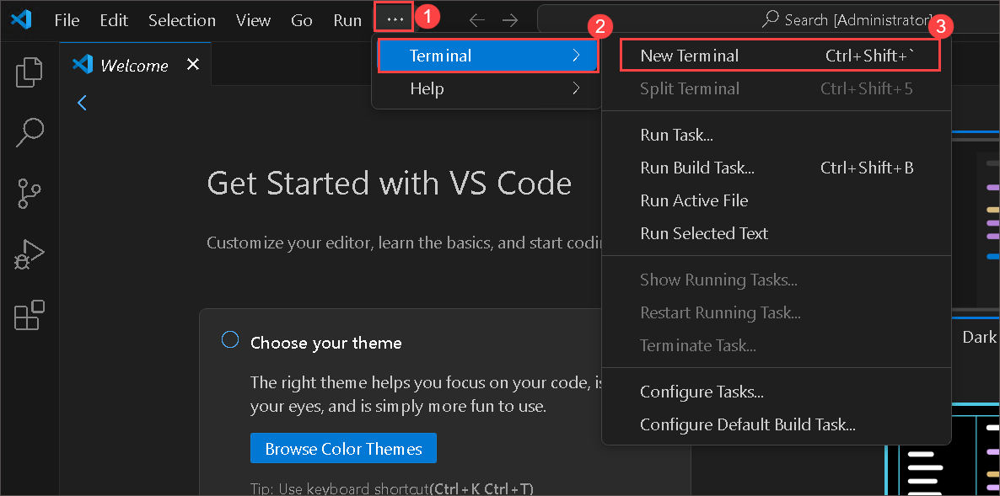

1. Make sure your in **ContosoHotel** folder.  

   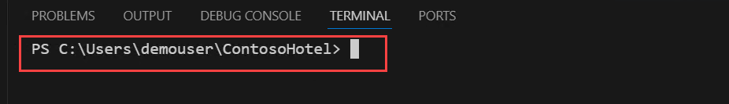
  
1. Enter the following command at the Terminal window prompt and press **Enter**. This command creates a directory for front-end components.

   ```
   mkdir -p ContosoHotel/UpdatedApp/Frontend 
   ```

    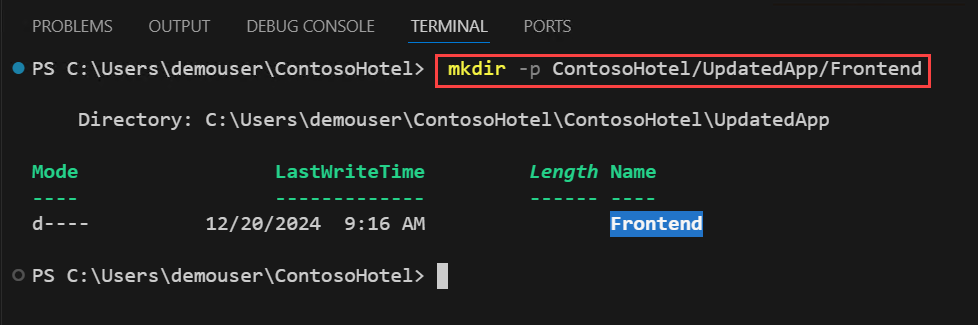

1. Enter the following command at the Terminal window prompt and press **Enter**. This command creates a directory for back-end components.

   ```
   mkdir -p ContosoHotel/UpdatedApp/Backend
   ```
    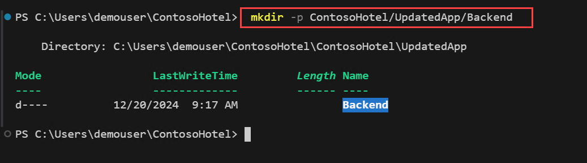    

1. From the top left corncer menu select **File (1)** >  **Open Folder (2)**.

   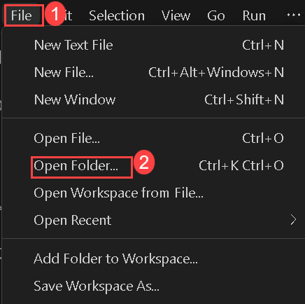

1. Naviagte to `C:\Users\demouser\ContosoHotel\ContosoHotel\UpdatedApp` in the File explorer and press **Enter**.

   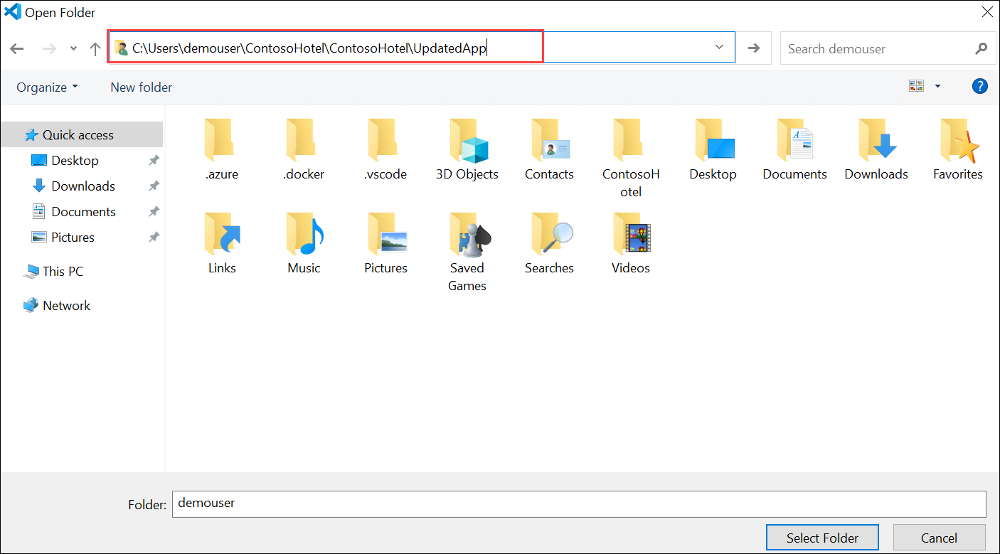

1. Verify that the subfolders that you have created are present.   

   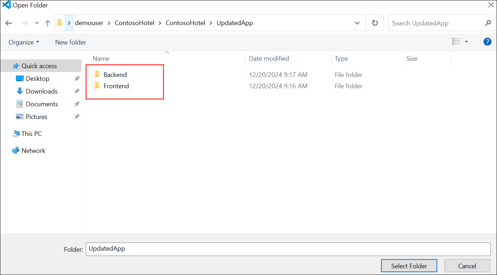

1. Enter the following commands at the Terminal window prompt and press **Enter**. These commands copy all necessary files to the **Frontend** folder for the updated app.   

   ```
   cp startup.* C:\Users\demouser\ContosoHotel\ContosoHotel\UpdatedApp\Frontend
   cp uwsgi.ini C:\Users\demouser\ContosoHotel\ContosoHotel\UpdatedApp\Frontend
   cp Dockerfile C:\Users\demouser\ContosoHotel\ContosoHotel\UpdatedApp\Frontend
   cp *.docker* C:\Users\demouser\ContosoHotel\ContosoHotel\UpdatedApp\Frontend
   cp requirements.txt C:\Users\demouser\ContosoHotel\ContosoHotel\UpdatedApp\Frontend
   ```

    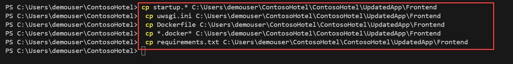  

1. Click on the **Frontend** drop down in the explorer, you can see all the copied files  appear under **Frontend** folder.   

      

1. Enter the following commands at the Terminal window prompt and press **Enter**. These commands create a subfolder in the **Frontend** folder and copy all necessary files to subfolder.    

   ```
   cp -r C:/Users/demouser/ContosoHotel/contoso_hotel/static C:\Users\demouser\ContosoHotel\ContosoHotel\UpdatedApp\Frontend\contoso_hotel\
   cp -r C:/Users/demouser/ContosoHotel/contoso_hotel/templates C:\Users\demouser\ContosoHotel\ContosoHotel\UpdatedApp\Frontend\contoso_hotel\
   cp C:/Users/demouser/ContosoHotel/contoso_hotel/*.py C:\Users\demouser\ContosoHotel\ContosoHotel\UpdatedApp\Frontend\contoso_hotel\
   ```

    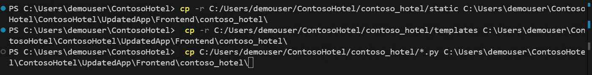   

1. Click on the **contoso_hotel** drop down under the **Frontend** folder in the Explorer. You can see the copied files.

    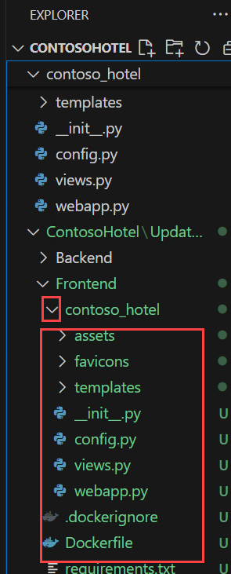  

1. Enter the following commands at the Terminal window prompt and press **Enter**. These commands copy all necessary files to the **Backend** folder for the updated app.    

   ```
   cp *.sql C:\Users\demouser\ContosoHotel\ContosoHotel\UpdatedApp\Backend
   cp startup.* C:\Users\demouser\ContosoHotel\ContosoHotel\UpdatedApp\Backend
   cp uwsgi.ini C:\Users\demouser\ContosoHotel\ContosoHotel\UpdatedApp\Backend
   cp *docker* C:\Users\demouser\ContosoHotel\ContosoHotel\UpdatedApp\Backend
   cp requirements.txt C:\Users\demouser\ContosoHotel\ContosoHotel\UpdatedApp\Backend
   ```

    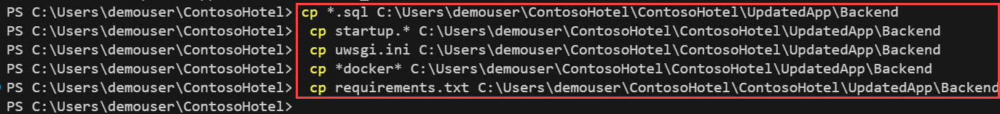    

1. Click on the **Backend** drop down in the explorer, you can see all the copied files  appear under **Backend** folder.   

    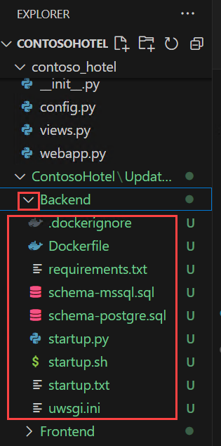      

1. Enter the following commands at the Terminal window prompt and press **Enter**. These commands create a subfolder in the **Backend** folder and copy all necessary files to subfolder.    


   ```
   cp -r C:/Users/demouser/ContosoHotel/contoso_hotel/dblayer C:\Users\demouser\ContosoHotel\ContosoHotel\UpdatedApp\Backend\contoso_hotel\
   cp C:/Users/demouser/ContosoHotel/contoso_hotel/*.py C:\Users\demouser\ContosoHotel\ContosoHotel\UpdatedApp\Backend\contoso_hotel\
   ```

    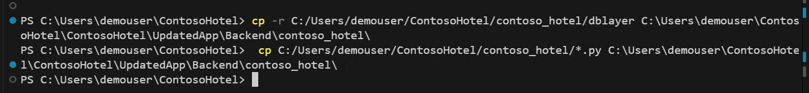  

1. Click on the **contoso_hotel** drop down under the **Backend** folder in the Explorer. You can see the copied files.

    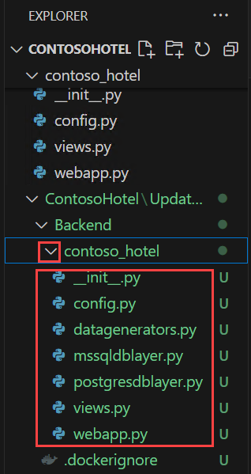       

### Task 2: Refactor files

In the previous task, you added a copy of **views.py** to both the **FrontEnd** and **Backend** folders. You added the **Dockerfile file** and the **requirements.txt** file to the FrontEnd folder. In this task, you’ll modify all three files to remove references to back-end functionality. You’ll also modify the copy of **views.py** in the **Backend** folder to remove references to front-end functionality.

1. In the Explorer pane, expand the **Frontend (1)** folder and then expand the **contoso_hotel (2)** folder.

    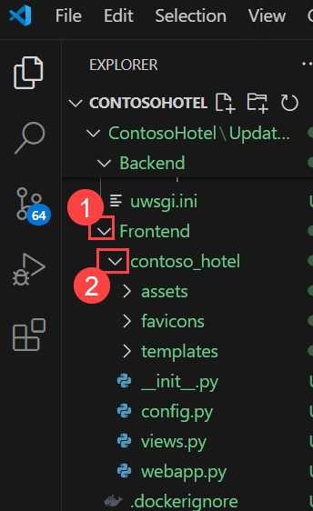     

1. Select **views.py**. The file displays in the right side of the Visual Studio Code window.    

    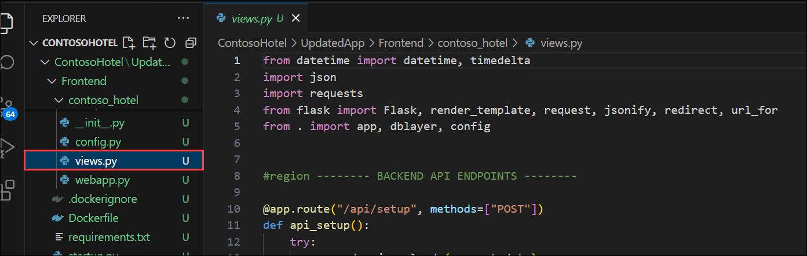  

1. Delete all code between the following region markers in the code (at or around lines 9 - 304).

   `#region -------- BACKEND API ENDPOINTS --------`
   
   `#endregion -------- BACKEND API ENDPOINTS --------`

    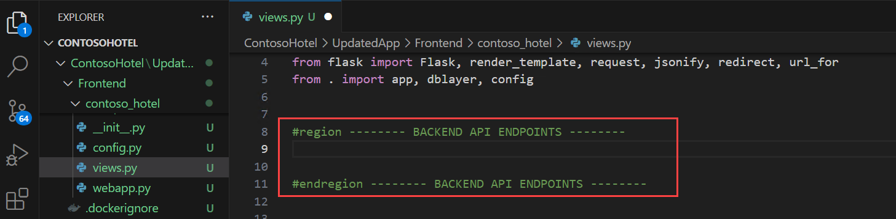     

1. Locate the line of code that imports dblayer (at or around line 5).   

    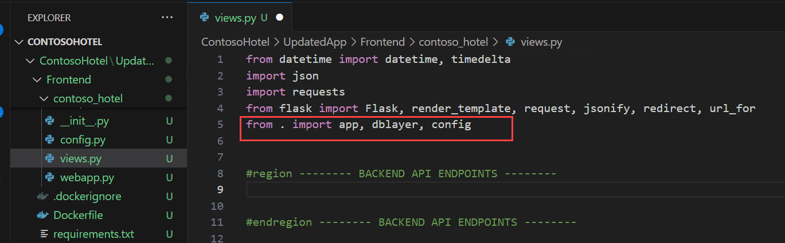   

1. Remove **dblayer,**.  

    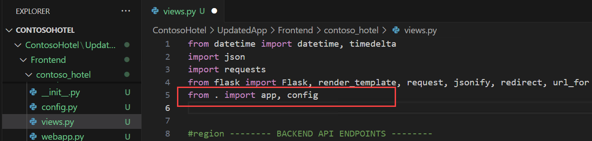 

     >**Note:** Don’t forget to delete the comma after dblayer.

1. Locate the code that checks to see **if the database is set up** (at or around lines 24-26):  

     

1. Delete the code that performs the database check.

    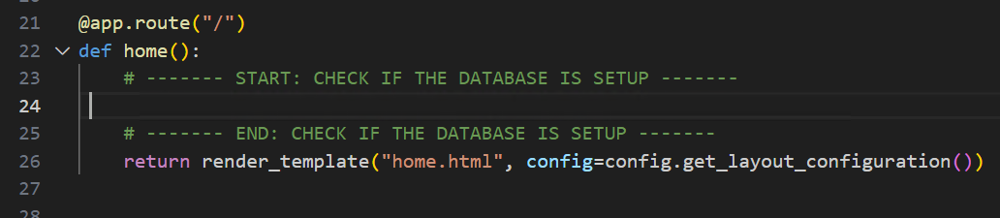 

1. Save your changes by pressing **Ctrl+S** in your keyboard or from the top left corner menu select **File** >  **Save** and then close the file.

1. In the Visual Studio Code Explorer pane, select **Dockerfile**. 

    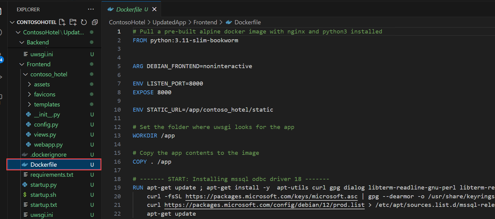 

1. Locate the code that installs the **MSSQL ODBC driver** (at or around lines 17-23):    

    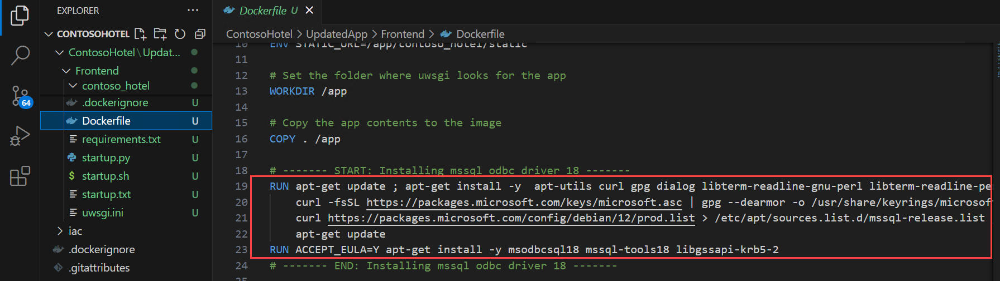 

1. Delete the code that installs the MSSQL ODBC driver.

    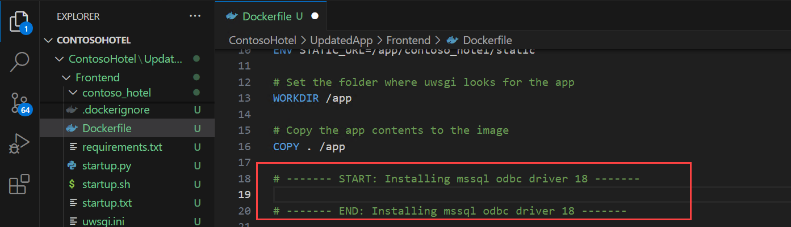 

1. Save your changes by pressing **Ctrl+S** in your keyboard or from the top left corner menu select **File** >  **Save** and then close the file.

1. In the Visual Studio Code Explorer pane, select **requirements.txt (1)** and then delete the **pyodbc** and **psycopg2-binary** **(2)** libraries.

     

1. Save your changes by pressing **Ctrl+S** in your keyboard or from the top left corner menu select **File** >  **Save** and then close the file.

    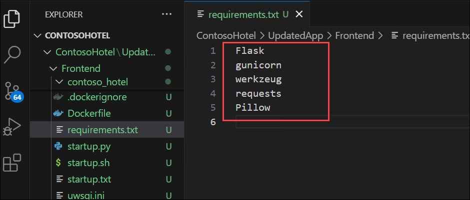 

1. In the Explorer pane, expand the **backend (1)** folder and then expand the **contoso_hotel (2)** folder.

    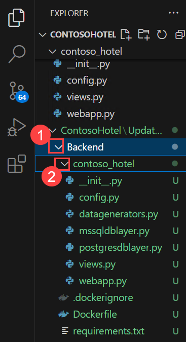 

1. Select **views.py**. Delete all code between the following region markers in the code for Frontend API Endpoints (around lines 312 - 335):   

    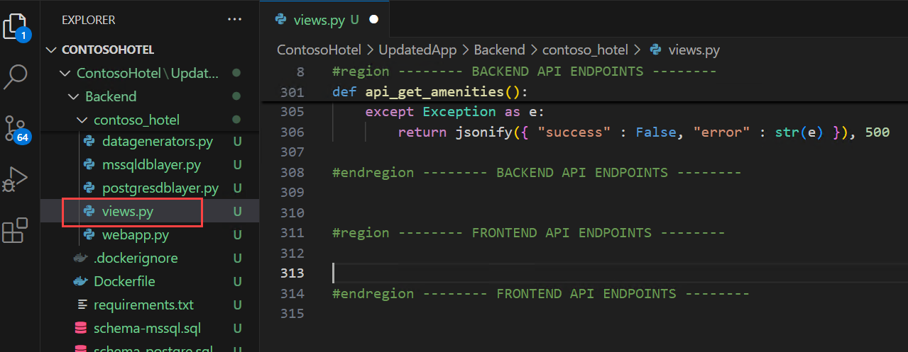 

1. Save your changes by pressing **Ctrl+S** in your keyboard or from the top left corner menu select **File** >  **Save** and then close the file.

1. Leave Visual Studio Code open. You’ll run additional commands in the next task.

### Task 3: Build the containers for front-end and back-end components and push the containers to Azure

In this task, you’ll build separate containers for front-end and back-end components.

1. Run the below command to get the name of the **Container Registry instance** that you have created in *Challenge 2 Task 3*.

   ```
   az acr list --query "[].{Name:name}" --output table
   ```

    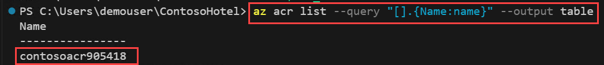  

1. Run the below command, update the following variable, replace *ACR_NAME_FROM_CHALLENGE02_TASK03* with the name of the instance that you recorded in Challenge 02 Task 03. The one which you got in the above command.   

   ```
   $ACR_NAME="ACR_NAME_FROM_CHALLENGE2_TASK03"
   ```

    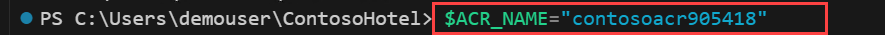  

1. Enter the following commands at the Terminal window prompt and press **Enter** to update the value for the **$PATH_TO_UPDATED_APP** variable to point to the **UpdatedApp** folder.

   ```
   $PATH_TO_UPDATED_APP = "C:\Users\demouser\ContosoHotel\ContosoHotel\UpdatedApp"
   ```

    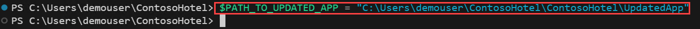  

1. In Visual Studio Code, enter the following command at the Terminal window prompt and press **Enter**. This command ensures that you are working in the correct folder.

   ```
   cd  $PATH_TO_UPDATED_APP\Frontend
   ```

    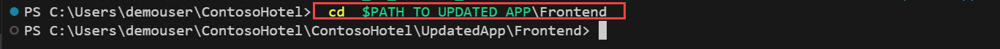  

1. Enter the following command at the Terminal window prompt and press **Enter**. This command builds the container for the front-end app components.

   >**Note:** Before running the command ensure that the Docker is running.

   ```
   docker pull python:slim-bookworm
   docker build -t "pycontosohotel-frontend:v1.0.0" .
   ```

    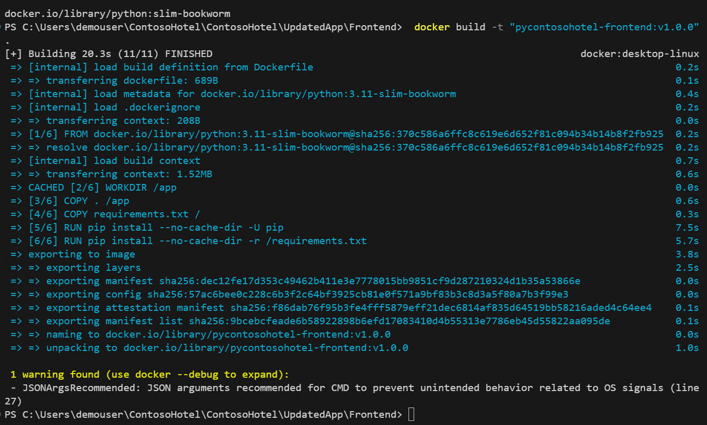  

     >**Note:** It may take 2-3 minutes to build the Docker container.

1. Enter the following command at the Terminal window prompt and then press **Enter**. This command signs you in to the ACR instance. 

   ```
   az acr login --name "$ACR_NAME"
   ```

    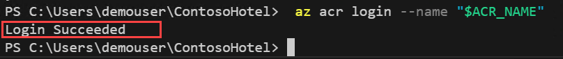       

1. Enter the following commands at the Terminal window prompt. These commands tag the front-end container and push the container to ACR.  

   ```
   docker tag "pycontosohotel-frontend:v1.0.0" "$ACR_NAME.azurecr.io/pycontosohotel-frontend:v1.0.0"
   docker push "$ACR_NAME.azurecr.io/pycontosohotel-frontend:v1.0.0"
   ```

    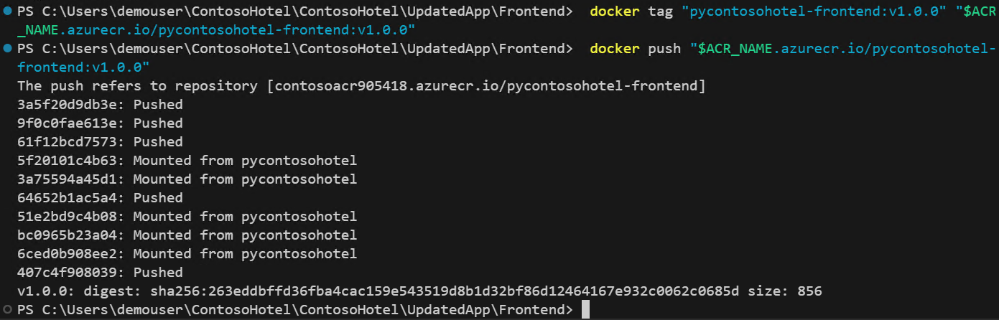  

1. Enter the following commands at the Terminal window prompt and press **Enter**. These commands switch the context to the Backend folder and then build the Docker container for the back-end app components.    

   ```
   cd  $PATH_TO_UPDATED_APP\Backend
   docker pull python:slim-bookworm
   docker build -t "pycontosohotel-backend:v1.0.0" .
   ```

    >**Note:** It may take 2-3 minutes to build the Docker container.

1. Enter the following commands at the Terminal window prompt and press **Enter**. These commands tag the back-end container and push the container to ACR.

   ```
   docker tag "pycontosohotel-backend:v1.0.0" "$ACR_NAME.azurecr.io/pycontosohotel-backend:v1.0.0"
   docker push "$ACR_NAME.azurecr.io/pycontosohotel-backend:v1.0.0"
   ```

    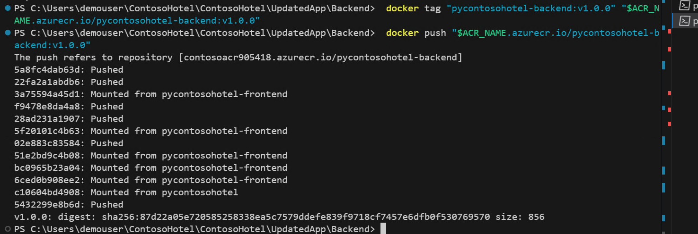 

1. Enter the following commands at the Terminal window prompt and press **Enter**. These commands register app providers.    

   ```
   az provider register --namespace Microsoft.App
   az provider register --namespace Microsoft.OperationalInsights
   ```

    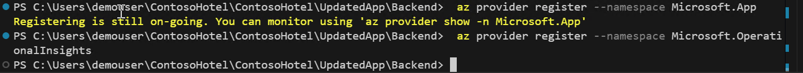 

     >**Note:** It may take 2-3 minutes for these commands to complete.

1. Update the value of the **AZURE_REGION_FROM_CHALLENGE1_TASK01** variable to use the region that you selected in Challenege 01 Task 01. Then, enter the command at the Terminal window prompt and then press **Enter**.   

   ```
   $AZURE_REGION="AZURE_REGION_FROM_CHALLENGE01_TASK01"
   ```

    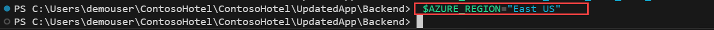 

1. Enter the following commands at the Terminal window prompt and press **Enter** after the last command. These commands create the container app environment.

   ```
   $CONTOSO_HOTEL_ENV = "contosoenv$(Get-Random -Minimum 100000 -Maximum 999999)"
   $CONTOSO_ACR_CREDENTIAL = az acr credential show --name $ACR_NAME --query "passwords[0].value" -o tsv
   az containerapp env create --name "$CONTOSO_HOTEL_ENV" --resource-group "Appmod" --location "$AZURE_REGION"
   Write-Host -ForegroundColor Green  "Default Domain is: $(az containerapp env show --name "$CONTOSO_HOTEL_ENV" --resource-group "Appmod" --query "properties.defaultDomain" -o tsv)"
   ```

    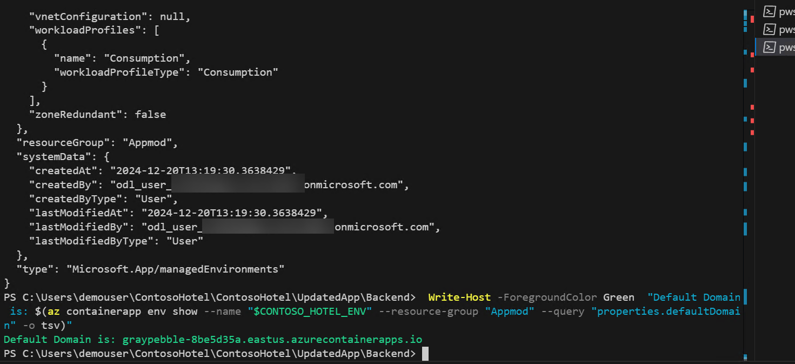 

     >**Note:** It may take 2-3 minutes for these commands to complete.

1. Replace the **ENTER_CONNECTION_STRING_FROM_CHALLENGE02_TASK04** placeholder text in the following command with the connection string you recorded in *Challenge 02 Task 04* . Enter the command at the Visual Studio Code Terminal window prompt and then select **Enter** after the last command. These commands create the container app for the back-end app components.

   ```
   az containerapp create --name "backend" --resource-group "Appmod" --environment "$CONTOSO_HOTEL_ENV" --image "$ACR_NAME.azurecr.io/pycontosohotel-backend:v1.0.0" --target-port 8000 --ingress external --transport http --registry-server "$ACR_NAME.azurecr.io" --registry-username "$ACR_NAME" --registry-password "$CONTOSO_ACR_CREDENTIAL" --env-vars "POSTGRES_CONNECTION_STRING='ENTER_CONNECTION_STRING_FROM_CHALLENGE02_TASK04'"
   $CONTOSO_BACKEND_URL = "https://$(az containerapp show --name "backend" --resource-group "Appmod" --query 'properties.configuration.ingress.fqdn' -o tsv)"
   Write-Host -ForegroundColor Green  "Backend URL is: $CONTOSO_BACKEND_URL"
   ```

    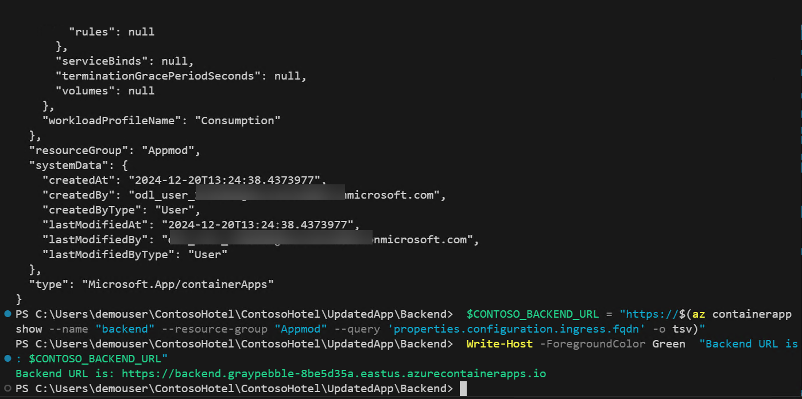 

1. Enter the following commands at the Terminal window prompt and press **Enter** after the last command. These commands create the container app for the front-end app components.

   ```
   az containerapp create --name "frontend" --resource-group "Appmod" --environment "$CONTOSO_HOTEL_ENV" --image "$ACR_NAME.azurecr.io/pycontosohotel-frontend:v1.0.0" --target-port 8000 --ingress external --transport http --registry-server "$ACR_NAME.azurecr.io" --registry-username "$ACR_NAME" --registry-password "$CONTOSO_ACR_CREDENTIAL" --env-vars "API_BASEURL=$CONTOSO_BACKEND_URL"
   $CONTOSO_FRONTEND_URL = "https://$(az containerapp show --name "frontend" --resource-group "Appmod" --query 'properties.configuration.ingress.fqdn' -o tsv)"
   Write-Host -ForegroundColor Green  "Frontend URL is: $CONTOSO_FRONTEND_URL"

   ```

    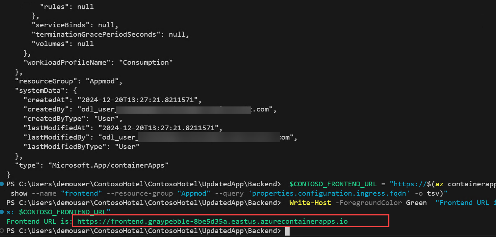 

     >**Note:** Record the value for the front-end URL. You’ll use the value later in the next steps.

1. Navigate to the Azure portal. If not signed in, sign in with the credentials given in the **Environment** tab.

1. In the top search bar, search for **Resource group (1)**, select **Resource group (2)** from the services.

    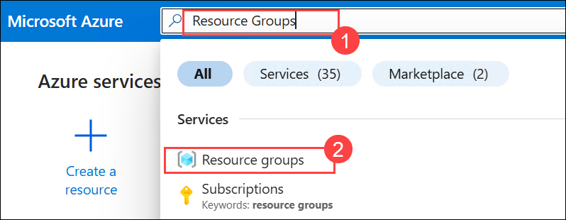 

1. Select the **Appmod** resource group.

     

1. Select the **backend** container app.    

    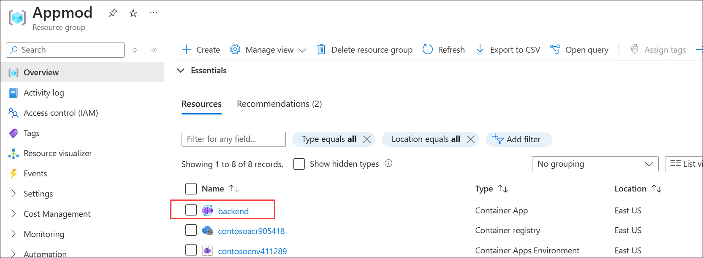 

1. In the left navigation pane for the container app, in the **Settings (1)** section, select **CORS (2)**.    

    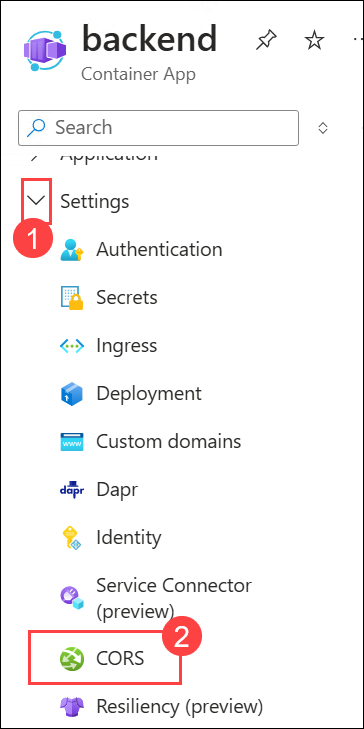 

1. In the **Allowed Origins (1)** field, enter the value for the front-end URL that you recorded in Step 14 of this task and then navigate to **Allowed Methods (2)** field.   

    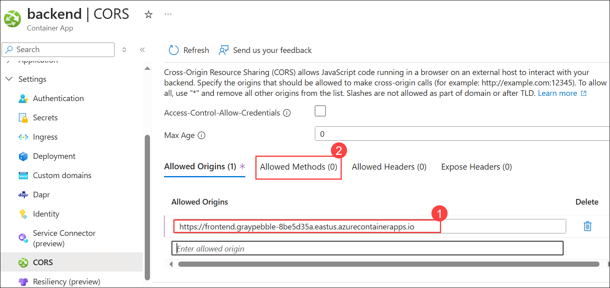 

1. Enter an asterisk `***` **(1)** and then select **Apply(2)** to create the CORS policy.  

    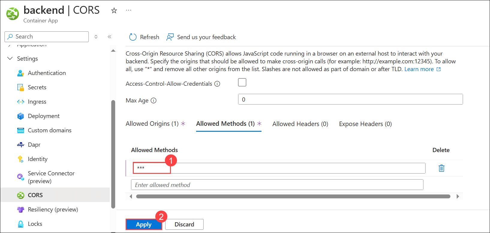 

1. Leave Visual Studio Code open. You’ll run additional commands in the next challenge.

## Success Criteria:

- You’ve created the UpdatedApp folder and the FrontEnd and Backend subfolders.
- You’ve copied the required files to the FrontEnd and Backend subfolders.
- You’ve updated views.py, Dockerfile, and requirements.txt files in the FrontEnd folder and removed back-end code and references to data libraries.
- You’ve updated views.py in the BackEnd folder and removed front-end code.
- You’ve created Docker containers for front-end and back-end application components.
- You’ve created an ACR environment and container apps.
- You’ve configured CORS policies.

## Additional Resources:

-  [Decompose a monolithic application](https://learn.microsoft.com/en-us/training/modules/microservices-architecture/)

-  [az containerapp create](https://learn.microsoft.com/en-us/cli/azure/containerapp?view=azure-cli-latest#az-containerapp-create)

## Proceed with the next Challenge by clicking on **Next**>>.


   


