# Challenge 05: Configure an AI Hub and Promptflow
### Estimated Time: 60 minutes
## Introduction

There are a lot of ways to create a chatbot. For this Challenge, you’ll use Prompt Flow within Azure AI Studio. Azure OpenAI Prompt Flow is a development tool designed to streamline the entire lifecycle of AI applications powered by Large Language Models (LLMs). Prompt Flow simplifies the process of prototyping, experimenting, iterating, and deploying AI applications.

Here's a simple overview of each service used:

- An **Azure AI Studio Hub** is a central resource within Azure AI Studio that helps teams manage, collaborate, and organize their AI projects.
- A **flow** encapsulates the logic that tells the chatbot what it can do and how to do things. Creating a flow can be complicated. For this challenge, you’ll use a pre-built flow. The flow uses the OpenAI API to directly query the Azure Search index.

## Solution Guide

### Task 1: Create a postgresql user and set up an AI Hub and Prompt Flow

In this task, you’ll create a hub and then create a project within the hub. You’ll also create a PostgreSQL user so that the flow can access the database records.

1. On the Azure Home page, select the **PostgreSQL database** that you created in a previous Challenge.

    

1. Copy and paste the the **Server name** that appears in the **Overview** section for your database server in a notepad.

    

1. On the pane bar for the database server, select **Cloud Shell** icon.

    

1. Then select **Bash** in the Cloud Shell pane.     

    

1. Select your **Subscription** from the dropdown list **(1)** and then select **Apply (2)**.

    

1. Replace the value for **POSTGRESQL_SERVERNAME** with the Server name that appears in the Overview section for your database server that you copied in the previous step. Then, enter the following commands at the Cloud Shell prompt an press **Enter**. These commands connect to the database.   

   ```
   export PGHOST="POSTGRESQL_SERVERNAME"
   export PGUSER="contosoadmin"
   export PGPORT="5432"
   export PGDATABASE="pycontosohotel"
   export PGPASSWORD="1234ABcd!"
   psql
   ```

    

1. Next to `pycontosohotel`, Enter the following SQL statement at the Cloud Shell prompt and press **Enter**. This statement creates a read-only user for the Prompt flow chatbot:

   ```
   CREATE USER promptflow WITH PASSWORD '1234ABCD!';
   ```

    

1. Next to `pycontosohotel`, Enter the following SQL statement at the Cloud Shell prompt and press **Enter**.These statements grant the user access to the database tables.

   ```
   GRANT SELECT ON TABLE hotels TO promptflow;
   GRANT SELECT ON TABLE bookings TO promptflow;
   GRANT SELECT ON TABLE visitors TO promptflow;
   GRANT EXECUTE ON FUNCTION getroomsusagewithintimespan TO promptflow;
   ```

    

1. Return to Visual Studio Code. Enter the following command at the Terminal window prompt and press **Enter**. This command creates a unique name for an **AI Hub**.

   ```
   $AI_HUB_NAME="ai-hub$(Get-Random -Minimum 100000 -Maximum 999999)"
   Write-Host -ForegroundColor Green  "AI Hub name is: " $AI_HUB_NAME
   ```

    

     >**Note:** Record the name of the AI Hub. You’ll use the name later in this task.

1. Open a **New InPrivate window**, navigate to `https://ai.azure.com/`.     

1. Select **Sign in**. 

1. If prompted, enter your credentials to sign into Azure AI Studio:

     >**Note:** You can find the **Username** and **Password** within the environment by navigating to the **Environment** tab in the left pane.

1. Click on **+ Create project**.

    

1. Click on **Customize.**

    

1. On the **Create a project** page, provide the following details and then click on **Next (6)**.

    - Hub name: **Enter AI Hub name that you recorded in step 9 of this task (1)**.
    - Subscription: **Leave the default Subscription (2)**
    - Resource group: Select **Appmod (3)** from the drop down list.
    - Location: **Enter the location for the region where you deployed all other resources (4)**
    - Connect Azure AI Services or Azure OpenAI Service: **Select the name for the OpenAI service instance that you deployed in challenge 01 (5)**

          

1. On the **Review and finish** page, select **Create**. 

    

1. Wait until the new AI hub, storage account, and key vault are created.

    

     >**Note:** While the resources are being provisioned, take a screenshot of the page that displays or copy and paste the resource name. *You’ll need to enter the **AI Hub** name and the **Storage account** name later in this task*. 

1. Navigate back to the **Azure portal**.

1. On the Azure Home page, select **Resource groups** and then select **Appmod**.

1. You should see two storage accounts. The first is the storage account that you created earlier in the lab. *The other was created by the AI Hub. Select the storage account that was created by AI Hub*.

    

     >**Note:** The name for the newly created storage account will start with **st**.

1. In the left navigation pane for the storage account, select A**ccess Control (IAM) (1)**. On the Access Control (IAM) page, on the **Grant access to this resource** tile, select **Add role assignment (2)**.

    

1. In the Search field, enter **Storage Blob Data Owner (1)** and then select **Storage Blob Data Owner (2)** from the list of search results. Select **Next (3)**.

    

1. On the **Add role assignment** page, select **+Select members (1)**. In the Select members pane, search for your username provided in the Environment tab **(2)** and select your user name **(3)**. Select **Select (4)** to close the Select members pane.    

    

1. Then, select **Review + assign** twice.  

    

1. On the **Access Control (IAM)** page, on the **Grant access to this resource** tile, select **Add role assignment** to add a second role assignment.    

    

1. In the Search field, enter **Storage Blob Data Reader (1)** and then select **Storage Blob Data Reader (2)** from the list of search results. Select **Next (3)**.

    

1. On the **Add role assignment** page, select **+Select members (1)**. In the Select members pane, search for and select the name for the *AI Hub that you created in Step 9 of this task* **(2)(3)** and then select **Select (4)**.

    

1. Then, select **Review + assign** twice.

    


### Task 2: Import and configure a flow 

A flow encapsulates the logic that tells the chatbot what it can do and how to do things. The flow uses the OpenAI API to directly query the Azure Search index.

In this task, you’ll import a pre-built flow, configure flow settings, and then test the flow.  

1. Return to the Azure AI Studio browser window that is opend in private window.

1. Click on **All hubs+projects (1)** and then  select the AI hub that you have created previously **(2)**.

    

1. Scroll down and click on **+ New project** on the Hub Overview. 

    

1. Provide the Project name as **contosopf (1)** and then click on **Create (2)**.

    

1. In the left navigation pane for the project page, in the **Build and customize** section, select **Prompt flow**.

    

1. On the **Create, iterate, and debug your orchestration flows** page, select **+Create**.

    

1. On the **Create a new flow** page, in the **Upload from local** section, select **Upload**.

    

1. On the **Upload from local** page, select **Zip file (1)** and then select **Browse (2)**.      

    

1. Go to the `C:/Users/demouser/AssetsRepo/Assets` folder and press **Enter.**

    

1. Select **chatflow-oai-datasources..zip (1)** and then select **Open (2)**.    

    

1. Under **Select flow** type, select **Chat flow (1)**. Then select **Upload (2)** to import the zip file into the project. 

    

     >**Note:** It may take several minutes to upload the flow. Separately, if the Upload button becomes available again, keep click on upload botton.  

1. This will load the prompt flow once uploaded. In the middle pane for the flow, you’ll see one flow for each of the four logical steps in the flow. Review the information in each tile. This will help you understand how the flow functions.

    

1. Navigate back to the **Azure portal.**

1. On the Azure Home page, select **Resource groups** and then select **Appmod**.

1. Select the PostgreSQL database that you created in a previous Challenge.

    

1. In the **Overview section** for the database, copy and paste the value for **Server name** in a notepad. You’ll pass the value into a field in Step 22 of this task. 

    

1. Return to the Azure AI Studio browser window that is opend in private window.

1. In the left navigation pane for the flow, select **Management center**.

    

1. Select **Connected resources (1)** in the **Project(contosopf)** section and then click on **+ New connection (2)**.

    

1. On the **Add a connection to external assets** page, search for **Custom keys (1)** and select **Custom keys (2)**.    

    

1. Select **+ Add key value pairs**.

    

1. Enter the following information and select **+ Add key value pairs (3)**.    

    | Field | Value |
    | -- | -- |
    | Custom keys | **hostname (1)**|
    | Value | **Use the server name you copied in Step 16 of this lab (2)**|    

         

1. Enter the following information.

    | Field | Value |
    | -- | -- |
    | Custom keys | **user**|
    | Value | **promptflow**|        

1. Select **+ Add key value pairs**.

1. Enter the following information.

    | Field | Value |
    | -- | -- |
    | Custom keys | **port**|
    | Value | **5432**|          

1. Select **+ Add key value pairs**.

1. Enter the following information.

    | Field | Value |
    | -- | -- |
    | Custom keys | **database**|
    | Value | **pycontosohotel**|        

1. Select **+ Add key value pairs**.

1. Enter the following information.  

    | Field | Value |
    | -- | -- |
    | Custom keys | **passwd**|
    | Value | **1234ABCD!**| 
    | Is Secret | **Selected**|

     

1. In the *Connection name* field, enter **postgresql (1)** and then select **Add connection (2)**.

    

1. Select **+ New Connection** again.    

    

1. Select **Azure AI Search (1)** and select **Azure AI Search (2)**.

    

1. Select **Add connection** to the right of your Azure AI Search Service.    

    

1. Click on **Close**.

    

1. In the left navigation pane, click on **Go to project.**

    

1. In the left navigation pane for the flow, in the **Build and customize** section, select **Prompt flow.** 

    

1. Select **Start compute session**. This allows you to run and test the chatbot.    

    

1. Locate the **check_question_intent** tile. Click on the  **Connection (1)** field drop down, select the connection that displays **(2)**.

    

1. Scroll down to the **chat_with_data** tile and below the Inputs section.   

    - Select Value of **search_connection** and then select your Azure AI Search Service from the dropdown list **(1)**.
    - Select Value of **ai_connection** and then select your Azure OpenAI resource from the dropdown list **(2)**.
    - Change the Value of **search_index** to **brochures-vector (3)**.

      

1. Scroll down to the **generate_sql** tile. In the **Connection** field, select the connection that displays.      

    

1. Scroll down to the bottom of the **conclude_answer** tile. We’ll input a value into the field that will populate after testing the next steps. 

1. If the compute session has started, select **Chat** to test the flow.

    

1. Enter `Where can I ski?` in the chat prompt and select **Enter (1)**. This will give you a warning and *populate the PostgreSQL **(2)** property at the bottom of the* **conclude_answer** tile.    

    

1. Select **Value** of **PostgreSQL** and then select **postgresql** from the dropdown list.    

    

1. Select the **X** on the warning in the Chat.    

    

1. Then send `Where can I ski?` again. Your results should resemble the following:

    

    - In the Graph,

      

1. Start a new conversation and enter `How many free rooms do hotels in Switzerland have grouped by hotel on 2024-10-10?`. Your results should resemble the following:     

    

    - In the Graph,

      

### Task 3: Deploy of configured prompt flow

1. In the prompt flow tab, click on **Deploy**.

    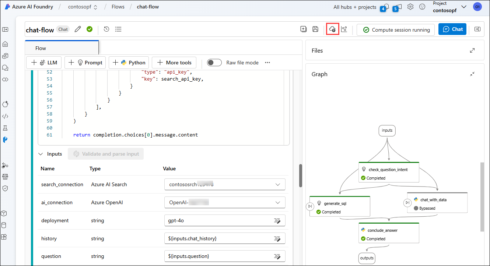

1. In the **Basic settings** tab of Deploy prompt flow, select the Virtual machine size as **Standard_D2a_v4** **(1)** and click on **Review + Create** **(2)** button.

    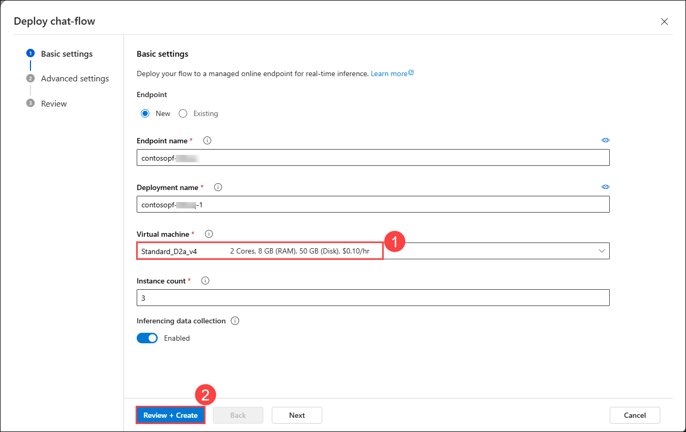

1. In the **Review** tab of Deploy prompt flow, click on **Create** **(1)** button.

    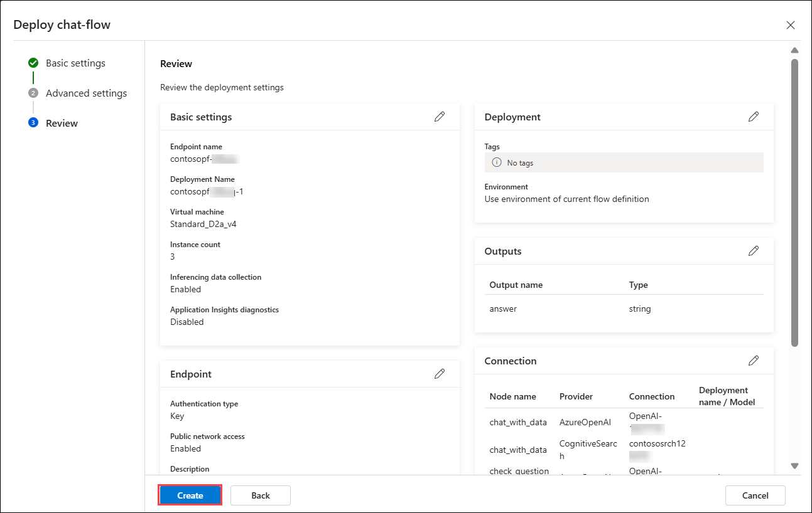

    > **Note**: The deployment of endpoint may take 5 minutes please wait.

1. Once the deployment got succedded, from the left side pane select **Models + endpoints** **(1)** under **My assests** session, and select the newly deployed endpoint **Contosopf-suffix** **(2)**.

    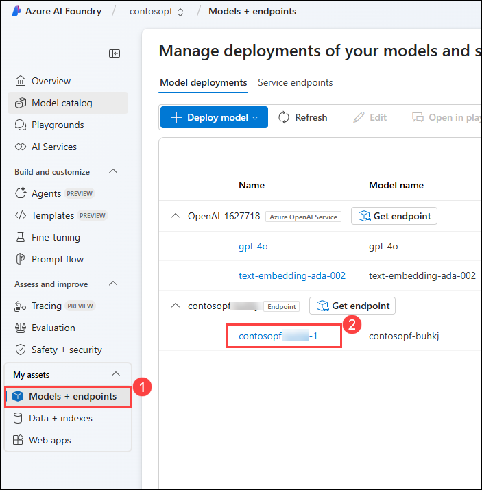

1. In the **contosopf-suffix** endpoint, copy the **Target URI** **(1)** and **Primary key** **(2)** under the Endpoint. Paste the values in a notepad.

    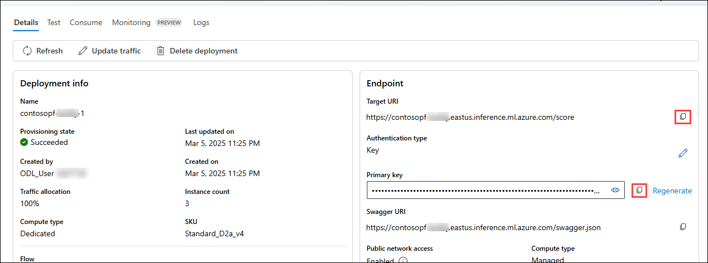

### Task 4: Configure Network Security Group Rules for External Access

1. Navigate back to the Azure portal, in the search bar **Network security groups** **(1)**, and select **Network security groups** **(2)**.

   

1. In the **Network security groups**, copy the the name on **Resource group name**  **(1)** and **NCG name** **(2)** of nvidia-gpu.

   

1. Configure Azure NSG rules for **nvidia-gpu** Virtual machines

   ```
   az network nsg rule create --resource-group youRGName --nsg-name myNSG --name allow-http --protocol tcp --priority 100 --destination-port-range 9000
   ```

   ```
   az network nsg rule create --resource-group youRGName --nsg-name myNSG --name allow-grpc --protocol tcp --priority 110 --destination-port-range 50051
   ```

   

   

   > **Note**: replace youRGName with Resource group name and myNSG with Network security groups name of nvidia-gpu 

1. In the Azure portal, in search bar **Virtual machines** **(1)**, and select **Virtual machines** **(2)**.

   

1. In the **Virtual machines**, copy the public ip of **nvidia-gpu** Virtual machines.

   

1. Add a new tab in the browser navigate to the below URL to check if the service is ready to handle inference requests.

   ```
   http://<nvidia-gpu-public-ip>:9000/v1/health/ready
   ```

   

### Task 5: Setting Up and Running the AI-Powered Speech-to-Text and Chat Application

1. Open **Visual Studio Code** from the Lab VM desktop by double-clicking on it.

1. In **Visual Studio Code**, from the top left pane, select the **(...) (1)** ellipses > **Terminal (2)**, then choose **New Terminal (3)**.

   

1. Execute the following command in the terminal to clone the repository to a local folder: (it doesn't matter which folder).

   ```
   git clone https://github.com/CloudLabsAI-Azure/NVIDIA-Speech-to-text.git
   ```
    
    

1. When the repository has been cloned, open the folder in Visual Studio Code by following these steps:

    - From the top left corner pane select **File (1)** >  **Open Folder (2)**.

       
      
    - Within the file explorer in **Quick access** select **NVIDIA-Speech-to-text (1)** then click on **Select folder (2)**.

       
      
    - If **Do you trust the authors of the files in this folder?** prompted click on **Yes, I trust the authors**.

         

       > **Note**: If you are prompted to add required assets to build and debug, select **Not Now**.

1. In **Visual Studio Code**, from the top left pane, select the **(...) (1)** ellipses > **Terminal (2)**, then choose **New Terminal (3)**.

   

1. Run the fallowing command to install the Python package

    ```
    pip install -r requirements.txt
    ```

    

1. In the `.env` file update the vlaues `publicip` with **public ip** of nvidia-gpu Virtual machines, `Azure AI Foundry Model Endpoint URL` with **Target URI** **(1)** and `Azure AI Foundry Model Key` with **Primary key** **(2)**. 

    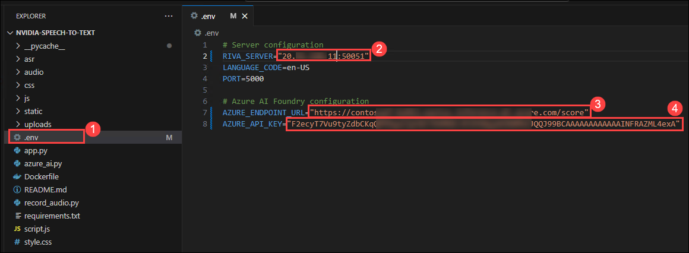

1. In **Visual Studio Code**, from the top left pane, select the file **Files** **(1)** and click on **Save** **(2)**.

    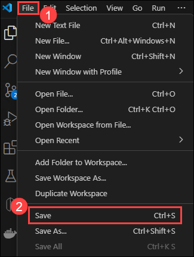

1. In **Visual Studio Code**, from the top left pane, select the **(...) (1)** ellipses > **Terminal (2)**, then choose **New Terminal (3)**.

   

1. Run the fallowing command the run the application locally.

    ```
    python app.py
    ```
   
   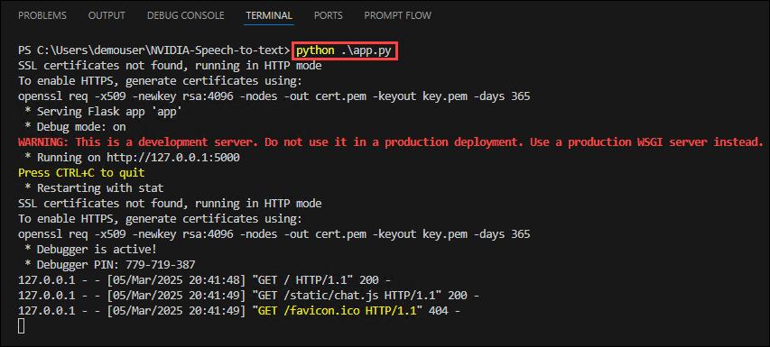

1. Open a web browser, copy and paste the following URL `http://127.0.0.1:5000/`

1. This application **supports both Riva Speech-to-Text and Chat with Azure AI services** running in **Prompt Flow**, which has been deployed.

1. The **AI Speech Assistant** page displays.

   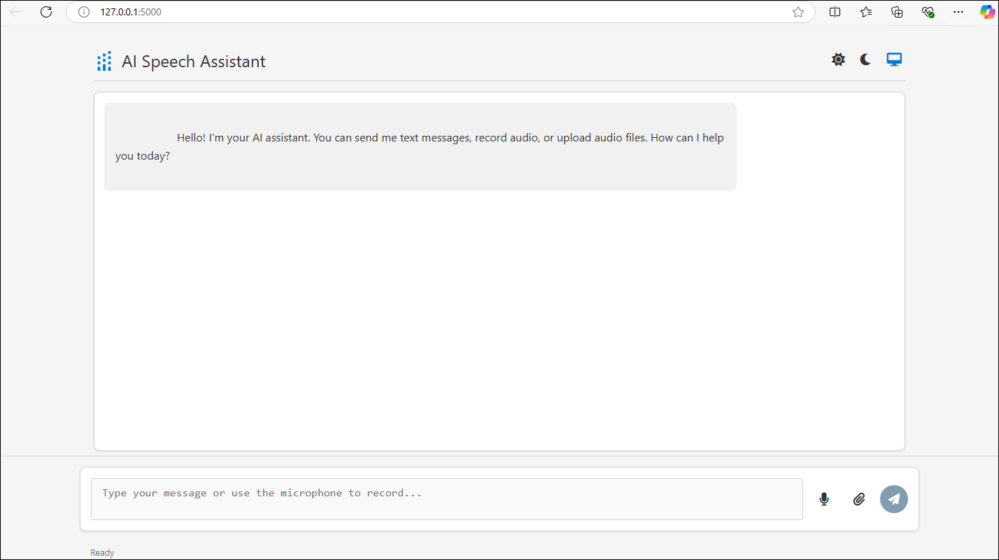

1. On the **AI Speech Assistant** page, click on **upload audio file** **(1)**, in the pop-up window naviagte to **NVIDIA-Speech-to-text\audio** **(2)** folder select any **one sample** **(3)** audio file click on **Open** **(3)** button.

    - `Sample 1.wav` with the question **"Where can I ski?"**  
    - `Sample 2.wav` with the question **"How many free rooms do hotels in Switzerland have, grouped by hotel, on 2024-10-10?"**

        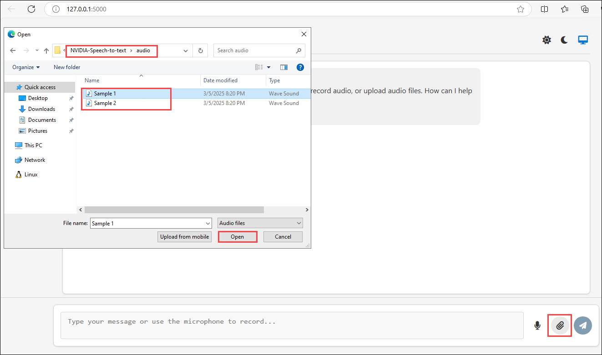

1. Select the `Sample 1.wav` **(1)** audio file, click on **send** **(2)** button and you will get response from RIVA model in **response** **(3)** session and **text box** **(4)**.

   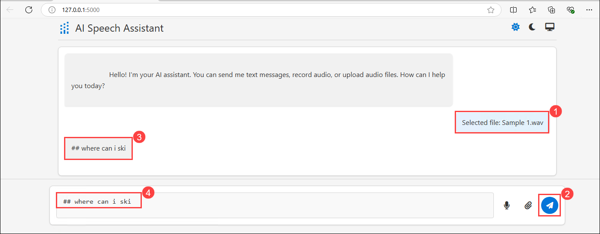

1. The response text from the **RIVA model** appears in the **text box** **(1)** as `## Where can I ski`. Click on the **Send** **(2)** button to trigger the **Prompt Flow**.

    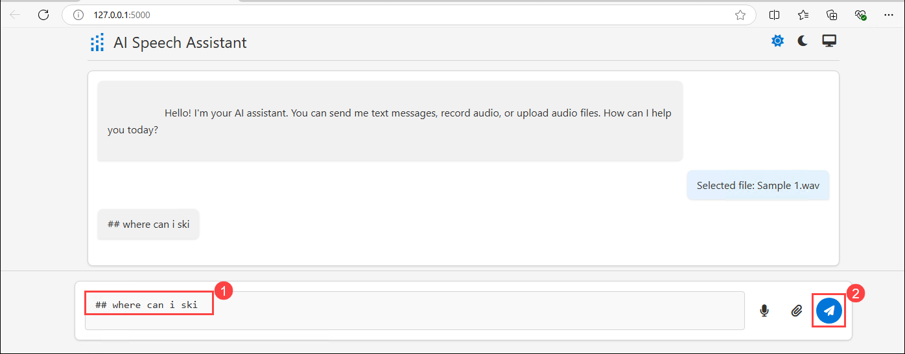

1. You can view the response from the **Prompt Flow** chat application.

    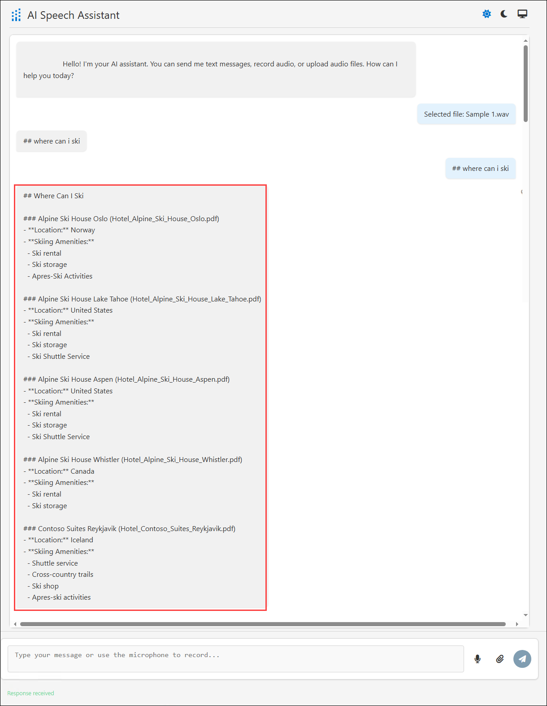

1. Simlar way you can try with `Sample 2.wav`

   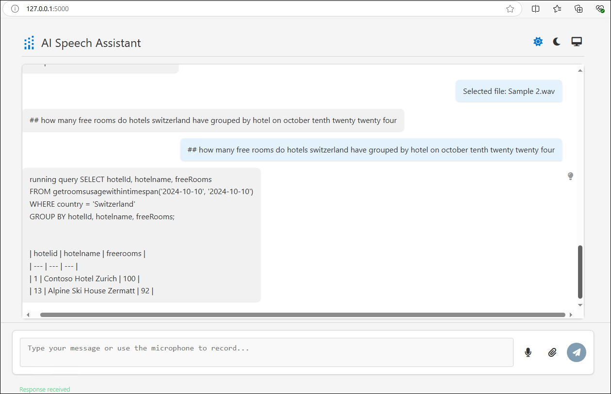

### Task 5: Containerizing and Deploying the AI-Powered Speech-to-Text and Chat Application (Optinal task)

1. Enter the following command at the Terminal window prompt and then press **Enter**. This command builds the container for the chatapp. Wait while the container builds.

   ```
   docker build -t "chatapp:v1.0.0" .
   ```
   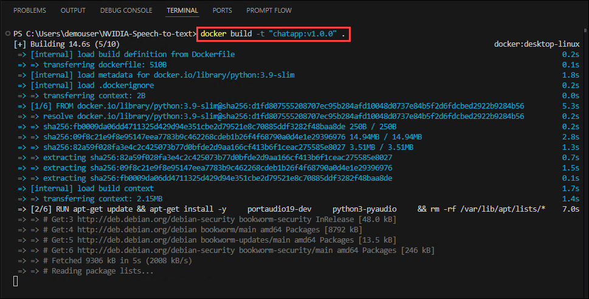

    >**Note:** It may take 2-3 minutes to build the container.

1. Enter the following command at the Terminal window prompt and then press **Enter**. This command connects the Terminal window with your Azure subscription so that you deploy Azure resources to the correct subscription.

   ```
   az login
   ```

      

1. Minimize the Visual Studio Code.

    - On the Let’s get you signed in page, select **Work or School account (1)** and then select **Continue (2)**. 

            

    - Sign in using your Azure credentials.

    - On the **Sign in** page, Enter the **Username (1)** and click on **Next (2)**.

           

       >**Note:** **Username**, you can find in the Lab VM's **Environment** page.

    - Enter the **Password (1)** and then click on **Sign in (2)**.  

           

       >**Note:** **Password**, you can find in the Lab VM's **Environment** page.   

    - On the **Stay signed in to all your apps** page, select **No sign in to this app only.**

               

1. Naviagte back to the Visual Studio code, press **Enter** for **Select a subscription and tenant**.      

   

1. Run the below command to get the name of the **Container Registry instance** that you have created in *Challenge 2 Task 3*.

   ```
   az acr list --query "[].{Name:name}" --output table
   ```

   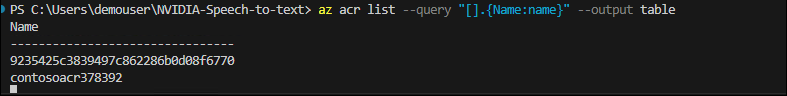

1. From the terminal copy the name Container registry which start with **contosoacr{suffix}**.

   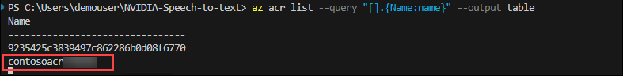

1. Run the fallowinf command to Container registry name 

    ```
    $ACR_NAME= "continer_name"
    ```

    > Note: Replace **continer_name** with **contosoacr{suffix}** which you copied in previous step

1. Enter the following command at the Terminal window prompt and then press **Enter**. This command signs you in to the ACR instance. 

   ```
   az acr login --name "$ACR_NAME"
   ```

    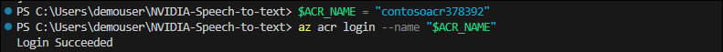

     >**Note:** You may see an error message stating the Azure could not connect to the registry login server. This error usually indicates that even though the container registry instance is provisioned, there’s still some configuration happening. Wait a few minutes and run the command again.

1. Enter the following command at the Terminal window prompt and then press **Enter**. This command creates a Docker tag for the app.  

   ```
   docker tag "chatapp:v1.0.0" "$ACR_NAME.azurecr.io/chatapp:v1.0.0"
   ```

1. Enter the following command at the Terminal window prompt and then press **Enter**. This command pushes the app container to ACR.    

   ```
   docker push "$ACR_NAME.azurecr.io/chatapp:v1.0.0"
   ```

    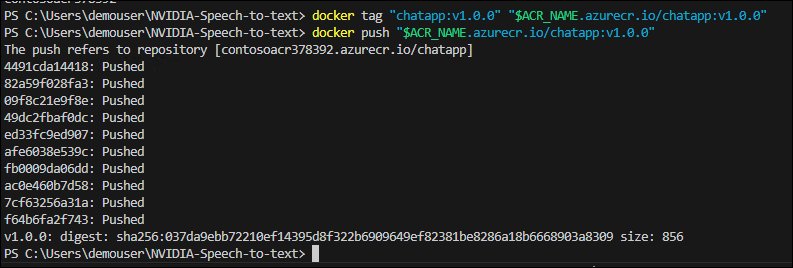

     >**Note:** It may take 1-2 minutes to push the app container to ACR.

1. Update the value of the **AZURE_REGION_FROM_CHALLENGE1_TASK01** variable to use the region that you selected in Challenege 01 Task 01. Then, enter the command at the Terminal window prompt and then press **Enter**.   

   ```
   $AZURE_REGION="AZURE_REGION_FROM_CHALLENGE01_TASK01"
   ```

     

1. Enter the following commands at the Terminal window prompt and press **Enter** after the last command. These commands create the container app environment.

     

     >**Note:** It may take 2-3 minutes for these commands to complete.

1. Enter the command at the Visual Studio Code Terminal window prompt and then select **Enter** after the last command. These commands create the container app for the chat app components.

   ```
   az containerapp create --name "Chatapp" --resource-group "Appmod" --environment "$CONTOSO_HOTEL_ENV" --image "$ACR_NAME.azurecr.io/pycontosohotel-backend:v1.0.0" --target-port 5000 --ingress external --transport http --registry-server "$ACR_NAME.azurecr.io" --registry-username "$ACR_NAME" --registry-password "$CONTOSO_ACR_CREDENTIAL"
   $CONTOSO_Chat_URL = "https://$(az containerapp show --name "Chatapp" --resource-group "Appmod" --query 'properties.configuration.ingress.fqdn' -o tsv)"
   Write-Host -ForegroundColor Green  "Chatapp URL is: $CONTOSO_Chat_URL"
   ```

## Success Criteria:

- You’ve successfully created a user in the PostgreSQL database.
- You’ve created a new AI Studio Hub and created a project.
- You’ve imported and configured a pre-built flow.
- You’ve tested the flow and confirmed that the flow returns appropriate results.

## Additional Resources:

-  Refer to the  [Secure Azure Database for PostgreSQL](https://learn.microsoft.com/en-us/training/modules/secure-azure-database-for-postgresql/) to learn about the security features of Azure Database for PostgreSQL.
-  Refer to the  [Get started with prompt flow](https://learn.microsoft.com/en-us/training/modules/get-started-prompt-flow-ai-studio/) to learn about how to use prompt flow to develop applications that leverage language models in the Azure AI Foundry.


## Proceed with the next Challenge by clicking on **Next**>>.