### Task 1: Generate NGC API KEY

> **Note:** This process of getting the NGC API key is no longer recommended. The participant is recommended to get the API key through build.nvidia.com as mentioned on the Scenario page.

The NVIDIA API key is a unique identifier used to authenticate requests to NVIDIA's APIs, such as the NGC (NVIDIA GPU Cloud) services. This key allows developers to access various resources, including pre-trained models, GPU-accelerated software, and container images. Obtaining an API key typically involves creating an account on NVIDIA's developer portal and generating the key within the account settings. It is important to keep this key secure, as it grants access to your NVIDIA resources and can be used for billing purposes.

1. **Go to [build.nvidia.com](https://build.nvidia.com)**

1. **Login or Create an Account**:
Click on the **Login** button in the top-right corner to create a new account. Enter your organization email to receive free credits to use NVIDIA NIM and click **Next**.

   

   >**Note**: We recommend using your Email to log in, as this will provide you with 1,000 free credits. Alternatively, you can use the Username and Password available in the Environment tab to create an account; however, this option does not include free credits.

1. **Create Your NVIDIA Account**:
You will be redirected to a page where you can create your NVIDIA account. Provide your **Personal email address** **(1)** and then click on **Create (2)**.This account is required to download RIVA and start using it in your Azure platform.

   

1. On the **Create your Account**, page provide the following details and then click on **Create account (6)**.  

   - Email: Provide your **Personal email address (1)**
   - Password: Provide your **Password (2)**
   - Confirm password: Enter your password again **(3)**
   - Stay logged in: Check the box **(4)**
   - Enable **I am human** check box **(5)**

     >**Note:** You may be asked to choose the pictures. If requested, please complete and verify.

   

1. **Verify Your Email Address**:
Log into your **email** and you will get a verification code to your email to complete the verification process.

1. Enter the **code (1)** and click on **Continue (2)**.

   

1. **Privacy Settings**:
Once verification is complete, you'll be redirected to a page with privacy-related questions. Choose your privacy settings and click **Submit**.

   

1. **Create Your NGC (NVIDIA GPU Cloud) Account**:
In the next step, create your NGC account by providing your NVIDIA cloud account name. Provide any name for Account name and click on **Create NVDIA Cloud Account**.

   

### Success!

You have successfully created your NVIDIA NVAIE and NVIDIA Cloud accounts. Verify that you are provided with free 1000 credits to try out RIVA.

   

### Explore RIVA:

- Now you can explore all available RIVA! Use the search bar at the top to search for any model or RIVA task (e.g., search for "parakeet-ctc-1.1b-asr").
- Explore the search results, open the NIM of interest, and experiment with it.
- You are provided with **1000 free credits**, each translating into one API call. Therefore, you have **1000 API calls** to try out the RIVA.

   
  
- You can also call these RIVA in your Python application using the OpenAI library (refer to the Python code on the right) or using [Riva Python client API and CLI utils](https://github.com/nvidia-riva/python-clients.git).

   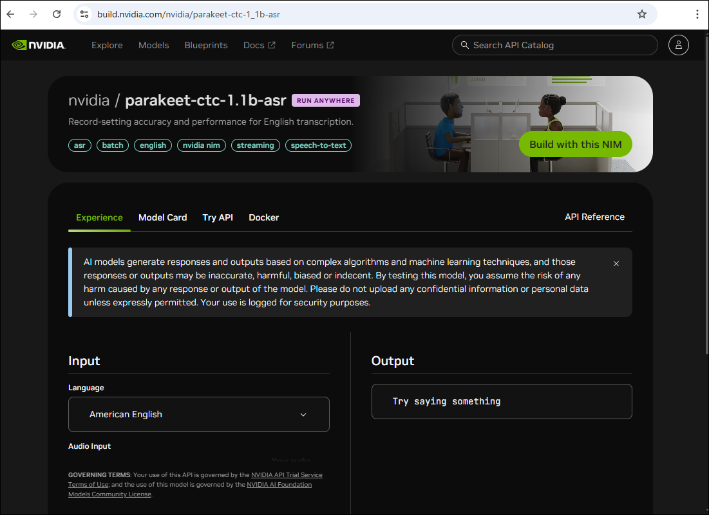

### Generate API Key

1. Now log in to [nvidia](https://ngc.nvidia.com/signin) account using your credentials to proceed. 

1. Enter your **Email address (1)** and click on **Continue (2)**.

   

1. On the **Set Your Profile** page, fill in your details and click **Submit**.

   

1. If you receive a pop-up for **Set Email Preferences For Your Services**, simply click on **Close**.

   

1. Once your account is created or you've successfully logged in.

1. You will see a pop-up. On the **Set Email Preferences For Your Services** page, you can either **close** it or click **Set Email Preferences** to receive updates regarding security, announcements, and maintenance for all your services.

   

1. In the search bar, look for **riva-asr** and select **Riva ASR NIM**. 

   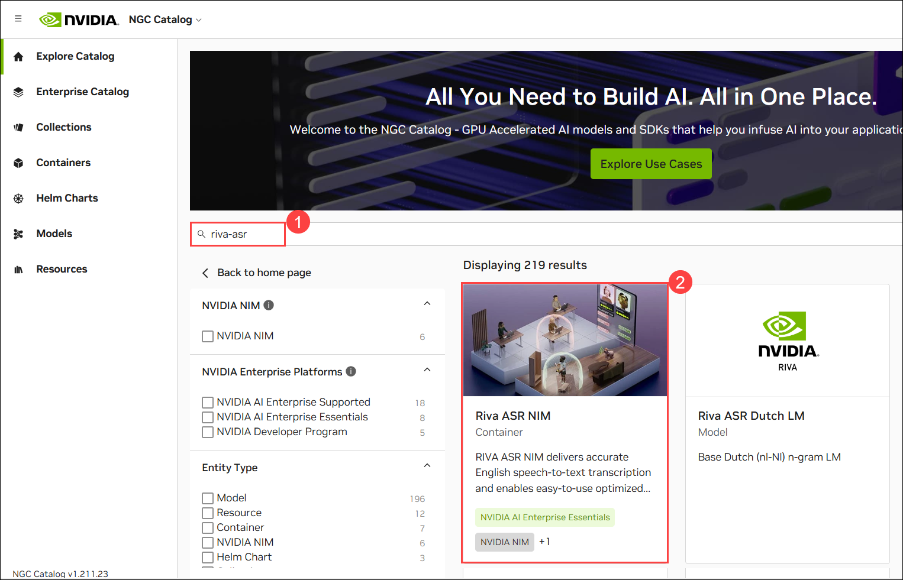

1. On the left-hand side, click **Get Container**.

   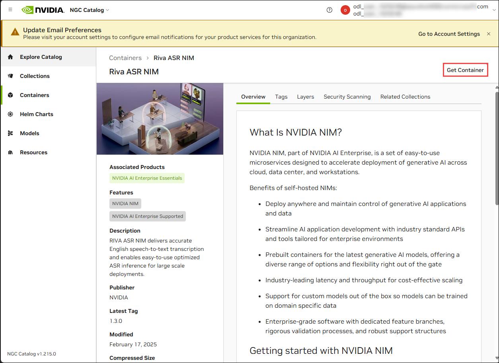

1. A pop-up will appear on the **Approval Required** page. Click **Join** for the **NVIDIA AI Enterprise Essentials**, and it will redirect you to the NVIDIA Developer Portal.

   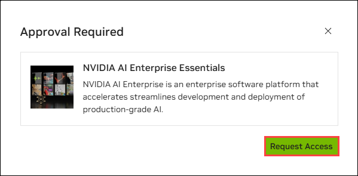

1. On the **NVIDIA Developer Portal**, under **Integrate NIM into your application**, provide the necessary details (you can also provide random details) and click **Join**.

   

1. Navigate back to your **NVIDIA Account**. Select  **Organization**.

   

1. click **Subscriptions (1)** on the left. Here, you will see the **Active (2)** status for the NVIDIA AI Enterprise Essentials.

   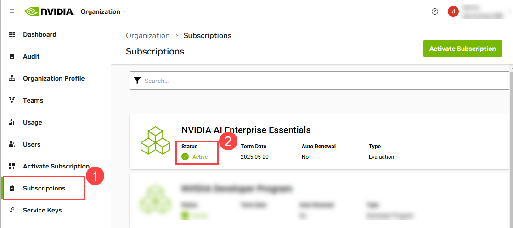

    >**Note**: Click on **Close**, if **Set Email Preferences For Your Services** pop up appears. 

1. Click on **Account** at the top of the page and navigate to the **Setup** section.

   

1. Click on **Generate API Key** to create a new key for accessing the necessary services.

   

1. From the top, click on **+ Generate API Key** to create a new API key.

   

1. Click on **Confirm** to generate your new API key.

   

1. Carefully copy and paste your generated **API key** in a notepad, essential for accessing various services and features paste the API key in the notebook. Ensure you store it securely, as it may not be displayed again after you leave the page.

   

## Task 2: Create and Connect to a GPU-Enabled Virtual Machine in Azure

Looking at your document, Task 2 needs a proper title to match the formatting of the other tasks. Based on the content that follows (creating a VM with NVIDIA GPU capabilities and connecting to it via SSH), this title accurately describes the actions being performed.

1. Navigate back to **Azure Portal**, in the search bar search and select **Virtual machines** 

    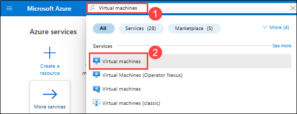

2. In the **Virtual machines** tab, select **+ Create** **(1)** and click on **Azure Virtual machines** **(2)**.

    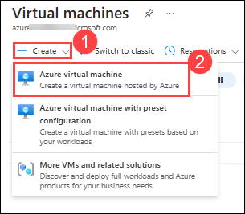

3. In the Create a virtual machine enter the following details

    - **Subscription**: Select avaliable Subscription.
    - **Resource group**: Select **Appmod**.
    - **Virtual machine name**: Provide a unique Virtual machine name (e.g nvidia-gpu)
    - **Region**:
    - **Availability options**: from the drop-down select **no infrastructure redundancy required**
    - **Security type**: from the drop-down select **Standard**
    - **Image**: click on **see all images**

        - In the **MarketPlace**, search **NVIDIA GPU-Optimized VMI with vGPU driver** **(1)** and in the **NVIDIA GPU-Optimized VMI with vGPU driver** click on **Select** **(2)** drop-dowm and select **NVIDIA GPU-Optimized VMI with vGPU driver - v22.08.0 - x64 Gen 2** **(3)** .

            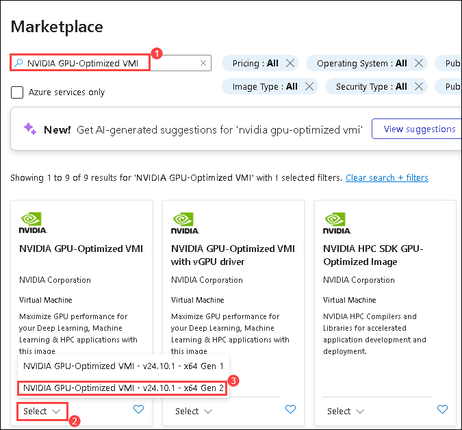

    - **Size**: click on **See all size** 

        - In the **Select a VM size** search **NC4as** **(1)** and select **NC4as_T4_v3** **(2)** and click on **Select** **(3)**.

            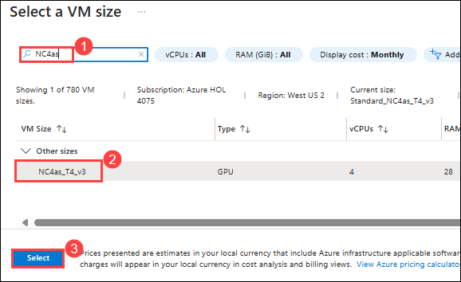
    
        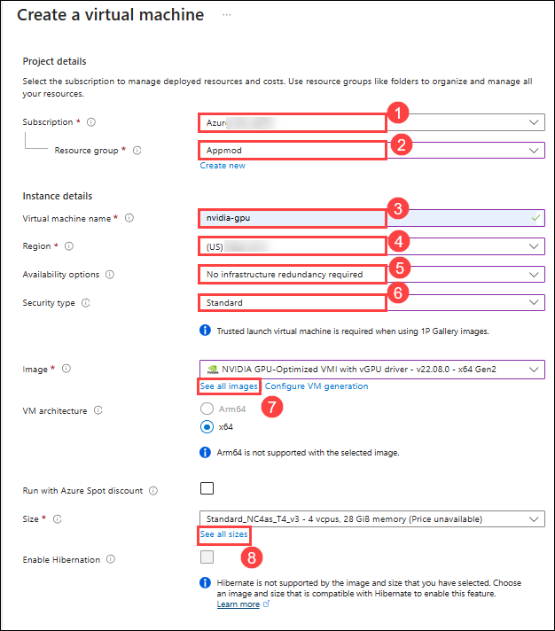

4. Under **Administrator account**, select the following details and click on **Next: Disks** **(5)**

    - **Authentication type**: Select Password **(1)**
    - **Username**: Provide a Username for vm **(2)**
    - **password**: Enter the password **(3)**
    - **Confirm password**: Enter the password **(4)**

        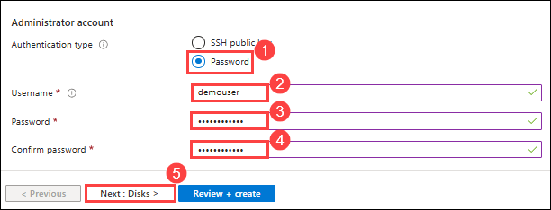

5. In the **Disks** tab select the **OS disk size** from the drop-down **128 GiB** **(1)** and **OS disk type** as **Standard SSD (locally-redudant storage)** **(2)** and click on **Review + Create** **(3)**.

    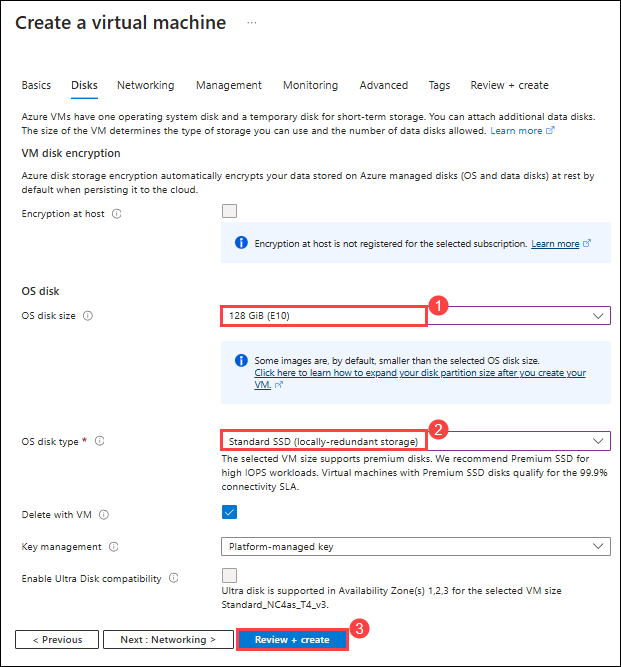

6. In the **Review + Create** tab click on **Create**.

    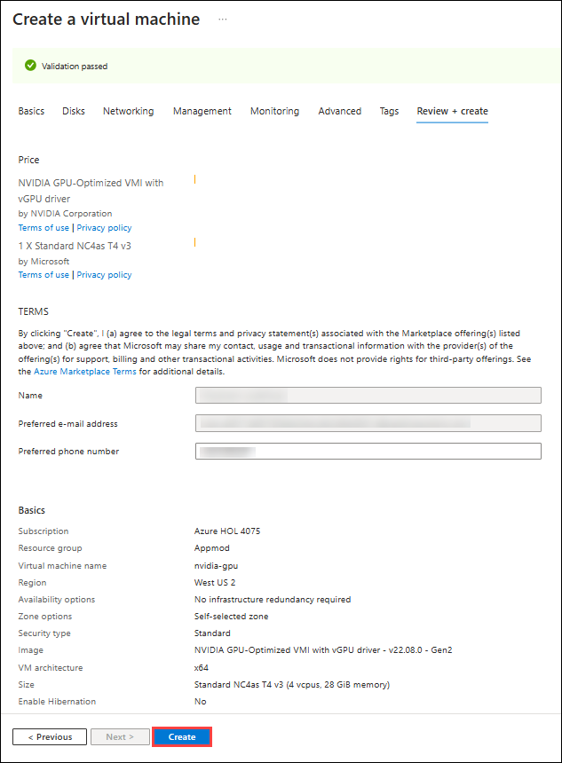

7. Once the deployment has succeeded click on **Microsoft.Compute/virtualMachines**

    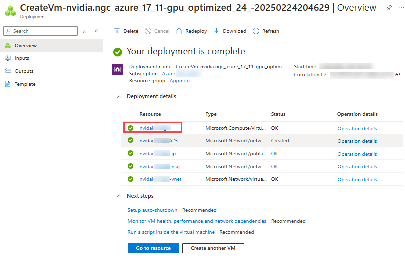

8. In the **Virtual machines**, expend the **Connect** **(1)** tab, click on **Connect** **(2)**, in the Connect click on **Select** **(3)** under Navtive SSH and once the Configure prerequisites for Native SSH succeeded under Copy and execute SSH command copy the **SSH to VM with specified private key** **Select** **(4)**.

    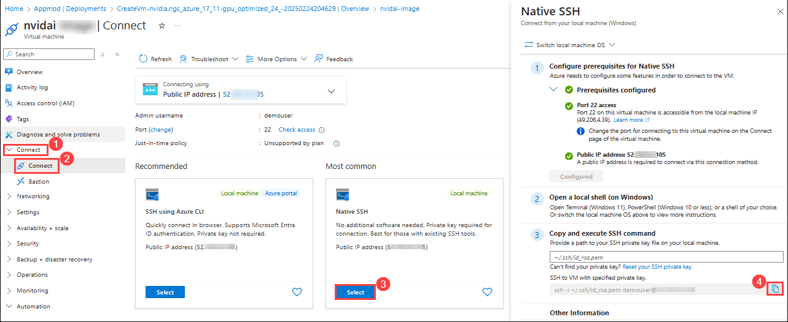

    > **Note**: Paste the SSH endpoint in a not notebook

9. In the JumpVM search for **cmd** **(1)** and select **Command Prompt** **(2)**

    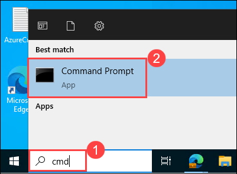

10. Paste the recoded **SSH endpoint** **(1)** and hit the **Enter** button, in **Are you sure you want to continue Connection (yes/no/[fingerprint])?** enter **yes** **(1)**, hit **Enter** button and enter the **password** **(3)** and hit **Enter** button.

    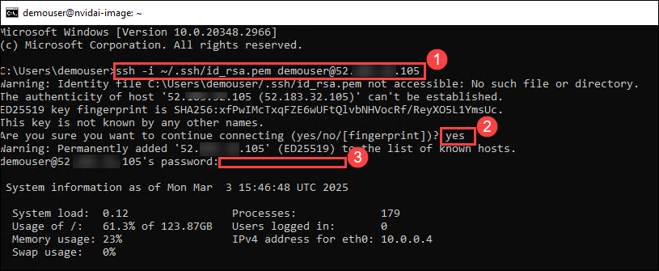

    > **Note**: Once you are connected to the virtual Machines takes 2-3 minutes to complete the setup process please wait till it gets completed.

### Task 3: Set Up and Run NVIDIA Riva ASR Container

1. Set up the NVIDIA Container Toolkit by adding your user to the docker group:
   
   ```bash
   sudo gpasswd -a $USER docker

   # Apply changes (logout/login required)
   newgrp docker
   ```

2. Configure your NGC API Key:

   ```bash
   # Set your NGC API Key (replace with your actual key)
   export NGC_API_KEY="your-ngc-api-key"

   # Add to shell configuration for persistence
   echo "export NGC_API_KEY=your-ngc-api-key" >> ~/.bashrc

   # Log in to NGC container registry
   echo "$NGC_API_KEY" | docker login nvcr.io --username '$oauthtoken' --password-stdin
   ```

3. Run the NVIDIA Riva ASR Container:
   
   ```bash
   # Set model selector
   export NIM_TAGS_SELECTOR="name=parakeet-1-1b-ctc-riva-en-us,mode=all"

   # Run the container
   docker run -it --rm --name=riva-asr \
      --gpus '"device=0"' \
      --shm-size=8GB \
      -e NGC_API_KEY \
      -e NIM_HTTP_API_PORT=9000 \
      -e NIM_GRPC_API_PORT=50051 \
      -p 9000:9000 \
      -p 50051:50051 \
      -e NIM_TAGS_SELECTOR \
      nvcr.io/nim/nvidia/riva-asr:1.3.0
   ```

   > **Note**: It may take up to 30 minutes for the Docker container to be ready and start accepting requests, depending on network speed.

[Getting Started — NVIDIA NIM Riva ASR](https://docs.nvidia.com/nim/riva/asr/latest/getting-started.html)
