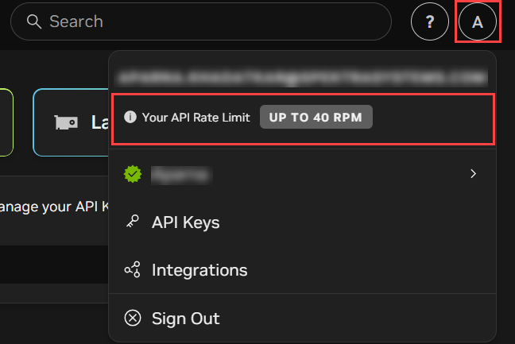
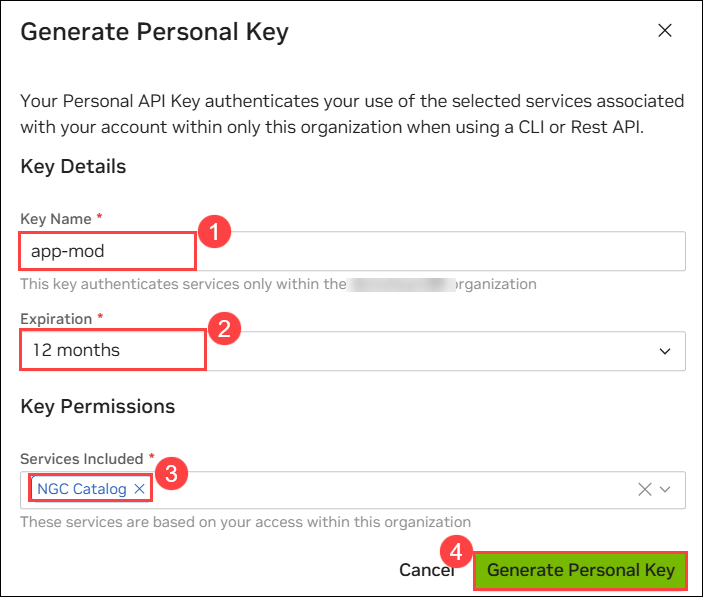
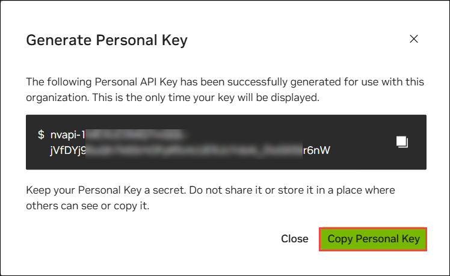
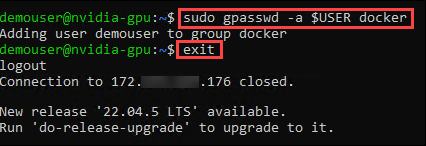
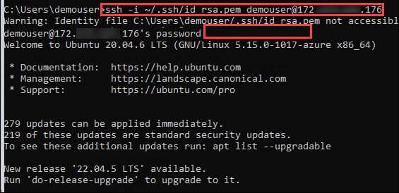
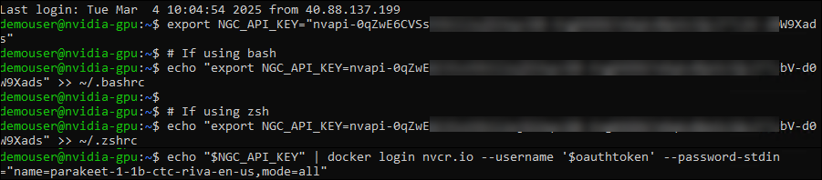
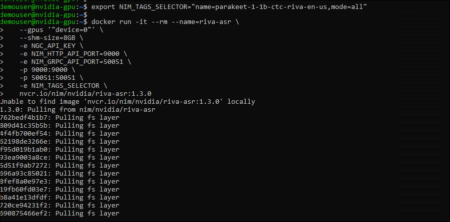
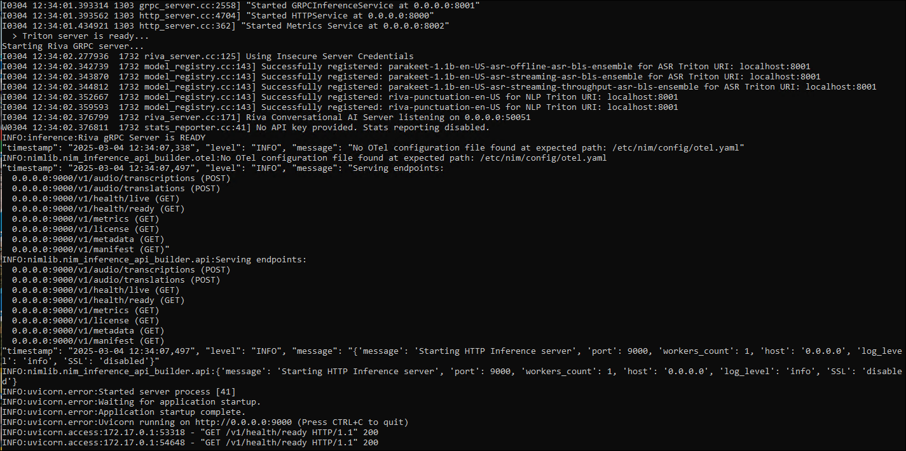
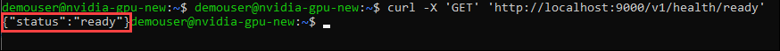

# Challenge  02: Deploy and Utilize NVIDIA Riva ASR on Azure

### Estimated Time: 45 Minutes

## Introduction

In this challenge, you will deploy and utilize NVIDIA Riva ASR (Automatic Speech Recognition) on an Azure GPU-enabled virtual machine. You will generate the necessary NVIDIA API keys, create and configure a GPU-enabled virtual machine in Azure, set up and run the NVIDIA Riva ASR container, and configure network security group rules for external access. This challenge aims to provide hands-on experience deploying AI models and using cloud resources to create AI-ready applications.

Riva ASR NIM APIs provide easy access to state-of-the-art automatic speech recognition (ASR) models for multiple languages. Riva ASR NIM models are built on the NVIDIA software platform, incorporating CUDA, TensorRT, and Triton to offer out-of-the-box GPU acceleration.

Riva ASR supports mono, 16-bit audio in WAV, OPUS, and FLAC formats. If you do not have a speech file, use a sample speech file embedded in the Docker container launched in the previous section.

> **Note**: This challenge must be completed successfully as it is a prerequisite for Challenge 6. Ensure that all tasks and steps outlined in this challenge are executed properly and that the desired outcomes are achieved before proceeding to Challenge 6.

### Task 1: Generate NGC API KEY

> **Note:** This process of getting the NGC API key is no longer recommended. The participant is recommended to get the API key through build.nvidia.com as mentioned on the Scenario page.

The NVIDIA API key is a unique identifier used to authenticate requests to NVIDIA's APIs, such as the NGC (NVIDIA GPU Cloud) services. This key allows developers to access various resources, including pre-trained models, GPU-accelerated software, and container images. Obtaining an API key typically involves creating an account on NVIDIA's developer portal and generating the key within the account settings. It is important to keep this key secure, as it grants access to your NVIDIA resources and can be used for billing purposes.

1. **Go to [build.nvidia.com](https://build.nvidia.com)**

1. **Login or Create an Account**:
Click on the **Login** button in the top-right corner to create a new account. Enter your organization email to receive free credits for using NVIDIA NIM, and click **Next**.

   

   >**Note**: We recommend using your Email to log in, as this will provide you with 1,000 free credits. Alternatively, you can use the Username and Password available in the Environment tab to create an account. However, this option does not include free credits.

1. **Create Your NVIDIA Account**:
You will be redirected to a page where you can create your NVIDIA account. Provide your **Personal email address** **(1)** and then click on **Create (2)**.This account is required to download RIVA and start using it in your Azure platform.

   

1. On the **Create your Account** page, provide the following details and then click on **Create account (6)**.  

   - Email: Provide your **Personal email address (1)**
   - Password: Provide your **Password (2)**
   - Confirm password: Enter your password again **(3)**
   - Stay logged in: Check the box **(4)**
   - Enable the **I am human** check box **(5)**

     >**Note:** You may be asked to choose the pictures. If requested, please complete and verify.

   

1. **Verify Your Email Address**:
Log into your **email,** and you will get a verification code to complete the verification process.

1. Enter the **code (1)** and click on **Continue (2)**.

   

1. **Privacy Settings**:
Once verification is complete, you will be redirected to a page with privacy-related questions. Choose your privacy settings and click **Submit**.

   

1. **Create Your NGC (NVIDIA GPU Cloud) Account**:
In the next step, create your NGC account by providing your NVIDIA cloud account name. Provide a name for the account and click on **Create NVIDIA Cloud Account**.

   

### Success!

You have successfully created your NVIDIA NVAIE and NVIDIA Cloud accounts. Verify that you are provided with 40 requests per minute (RPM) to try out RIVA.

   

### Explore RIVA:

- Now, you can explore all available RIVA! Use the search bar at the top to search for any model or RIVA task (e.g., search for "parakeet-ctc-1.1b-asr").
- Explore the search results, open the NIM of interest, and experiment with it.
- You are provided with **40 requests per minute (RPM)**, each translating into one API call. Therefore, you have **40 requests per minute (RPM)** to try out the RIVA.


- You can also call these RIVA in your Python application using the OpenAI library (refer to the Python code on the right) or using the [Riva Python client API and CLI utils](https://github.com/nvidia-riva/python-clients.git).

   

### Generate API Key

1. Now, log in to your [Nvidia](https://ngc.nvidia.com/signin) account using your credentials to proceed. 

1. Enter your **Email address (1)** and click on **Continue (2)**.

   

1. On the **Set Your Profile** page, fill in your details and click **Submit**.

   

1. If you receive a pop-up for **Set Email Preferences For Your Services**, simply click on **Close**.

   

1. Once your account is created or you have successfully logged in.

1. You will see a pop-up. On the **Set Email Preferences For Your Services** page, you can either **close** it or click **Set Email Preferences** to receive updates regarding security, announcements, and maintenance for all your services.

   

1. In the search bar, look for **riva-asr** and select **Riva ASR NIM**. 

   

1. On the right-hand side, click **Get Container**.

   

1. A pop-up will appear on the **Approval Required** page. Click **Join** for the **NVIDIA AI Enterprise Essentials**, and it will redirect you to the NVIDIA Developer Portal.

   

1. On the **NVIDIA Developer Portal**, under **Integrate NIM into your application**, provide the necessary details (you can also provide random details) and click **Join**.

   

1. Navigate back to your **NVIDIA Account**. Select  **Organization**.

   

1. Click **Subscriptions (1)** on the left. Here, you will see the **Active (2)** status for the NVIDIA AI Enterprise Essentials.

   

    >**Note**: Click on **Close** if the **Set Email Preferences For Your Services** pop-up appears. 

1. Click on **Account** at the top of the page and navigate to the **Setup** section.

   

1. Click on **Generate API Key** to create a new key to access the necessary services.

   

1. From the top, click on **+ Generate API Key** to create a new API key.

   

1. Click on **Confirm** to generate your new API key.

   

1. In Generate Personal Key, fill in the following details and click on **Generate Personal Key** **(4)**.

   - Key name: Provide a name to the key (i.e app-mod) **(1)**
   - Expiration: 12 months **(2)**
   - Key Permissions: **NGC Catalog** **(3)**

      > Grants your key permission to access or download containers and artifacts from the NGC Catalog. The permission level matches your account's permissions for the catalog.

      
 
1. Carefully copy and paste your generated API key into a notepad, essential for accessing various services and features. Paste the API key into the notebook. Store it securely, as it may not be displayed again after you leave the page.

   

## Task 2: Create and Connect to a GPU-Enabled Virtual Machine in Azure

Looking at your document, Task 2 needs a proper title to match the formatting of the other tasks. Based on the content that follows (creating a VM with NVIDIA GPU capabilities and connecting to it via SSH), this title accurately describes the actions being performed.

1. Navigate back to **Azure Portal.** In the search bar, search for and select **Virtual machines.** 

    

2. In the **Virtual machines** tab, select **+ Create** **(1)** and click on **Azure Virtual machines** **(2)**.

    

3. In the Create a virtual machine, enter the following details:

    - **Subscription**: Select available Subscription.
    - **Resource group**: Select **Appmod**.
    - **Virtual machine name**: Provide a unique Virtual machine name (e.g. nvidia-gpu)
    - **Region**: East US
    - **Availability options**: from the drop-down, select **no infrastructure redundancy required**
    - **Security type**: from the drop-down, select **Standard**
    - **Image**: click on **see all images**

        - In the **MarketPlace**, search **NVIDIA GPU-Optimized VMI** **(1),** and in the **NVIDIA GPU-Optimized VMI,** click on **Select** **(2)** drop-down, and select **NVIDIA GPU-Optimized VMI - v24.10.1 - x64 Gen 2** **(3)** .

            

    - **Size**: Click on **See all size** 

        - In the **Select a VM size,** search **NC4as** **(1),** and select **NC4as_T4_v3** **(2),** and click on **Select** **(3)**.

            
    
        

4. Under **Administrator account**, select the following details and click on **Next: Disks** **(5)**

    - **Authentication type**: Select Password **(1)**
    - **Username**: Provide a Username for VM **(2)**
    - **password**: Enter the password **(3)**
    - **Confirm password**: Enter the password **(4)**

        

5. In the **Disks** tab, select the **OS disk size** from the drop-down **128 GiB** **(1)** and **OS disk type** as **Standard SSD (locally-redudant storage)** **(2)** and click on **Review + Create** **(3)**.

    

6. In the **Review + Create** tab, click on **Create**.

    

7. Once the deployment has succeeded, click on **Microsoft.Compute/virtualMachines**

    

8. Expand the **Connect** **(1)** tab and click on **Connect** **(2).** Moving on, click on **Select** **(3)** under Native SSH. Check "Configure prerequisites for Native SSH" success status and proceed with step **(4),** copying the **SSH to VM with specified private key** under **Copy and execute SSH command** option.

    

    > **Note**: Paste the SSH endpoint in Notepad

9. In the JumpVM, search for **cmd** **(1)** and select **Command Prompt** **(2)**

    

10. Paste the recoded **SSH endpoint** **(1)** and hit the **Enter** button. In **Are you sure you want to continue Connection (yes/no/[fingerprint])?** enter **yes** **(1)**, hit **Enter** button, and write the **password** **(3).** Click on the **Enter** button again.

    

    > **Note**: Once you are connected to the virtual Machines, it takes 2-3 minutes to complete the setup process. Please wait till it gets completed.

### Task 3: Set Up and Run NVIDIA Riva ASR Container

1. Run the following command to set up the NVIDIA Container Toolkit by adding your user to the Docker group:
   
   ```bash
   sudo gpasswd -a $USER docker
   exit
   ```

      

2. Re-login into the VM by pasting the recorded **SSH endpoint** **(1).** Hit the **Enter** button and include the **password** **(2)**.

   

3. Run the following command to configure your NGC API Key:

   ```bash
   # Set your NGC API Key (replace with your actual key)
   export NGC_API_KEY="your-ngc-api-key"

   # Add to shell configuration for persistence
   echo "export NGC_API_KEY=your-ngc-api-key" >> ~/.bashrc

   # Log in to NGC container registry
   echo "$NGC_API_KEY" | docker login nvcr.io --username '$oauthtoken' --password-stdin
   ```
   

   > **Note**: Replace your-ngc-api-key with your generated NGC_API_KEY in task 1.

4. Run the following command to download, deploy, and run the NVIDIA Riva model in Docker Desktop:
   
   ```bash
   # Set model selector
   export NIM_TAGS_SELECTOR="name=parakeet-1-1b-ctc-riva-en-us,mode=all"

   # Run the container
   docker run -it --rm --name=riva-asr \
      --gpus '"device=0"' \
      --shm-size=8GB \
      -e NGC_API_KEY \
      -e NIM_HTTP_API_PORT=9000 \
      -e NIM_GRPC_API_PORT=50051 \
      -p 9000:9000 \
      -p 50051:50051 \
      -e NIM_TAGS_SELECTOR \
      nvcr.io/nim/nvidia/riva-asr:1.3.0
   ```

   

   > **Note**: Please use the NGC keys provided below.
  
     ```
     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
     ```

   > **Note**: Setting up the NVIDIA Riva model within the Docker Desktop environment can be a time-consuming process. Depending on factors such as network speed and system performance, the setup procedure may take as long as one hour to complete. Please be patient and allow sufficient time for the installation and configuration to finish. Minimize the tab and proceed with the next challenge while monitoring the configuration every 20 minutes.

6. Once the NVIDIA Riva model has succeeded, start the new CMD session and connect it to the VM through SSH.

   

7. Run the following command to check if the service is ready to handle inference requests.

     ```
     curl -X 'GET' 'http://localhost:9000/v1/health/ready'
     ```

   - If the service is ready, you will get a response similar to the following.

     ```
     {"status":"ready"}
     ```

     


## Success Criteria

- Successfully generate the NGC API key through the NVIDIA build platform.
- Create and connect to a GPU-enabled virtual machine in Azure.
- Set up and run the NVIDIA Riva ASR container within the virtual machine.

## Additional Resources:

- [Getting Started — NVIDIA NIM Riva ASR](https://docs.nvidia.com/nim/riva/asr/latest/getting-started.html)
- [Python Client Repository](https://github.com/nvidia-riva/python-clients.git)
- [C++ Client Repository](https://github.com/nvidia-riva/cpp-clients.git)
